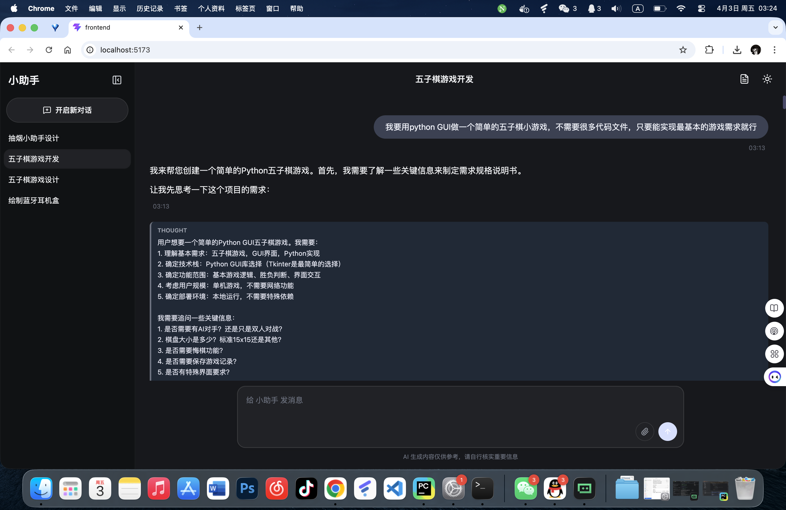
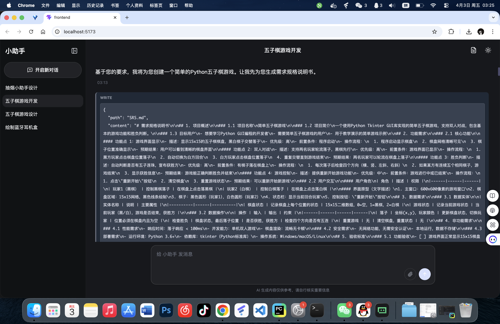
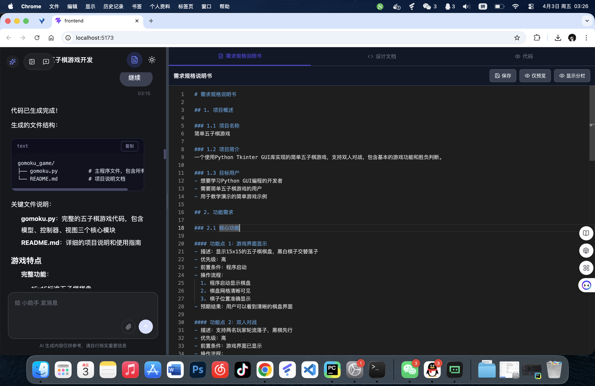
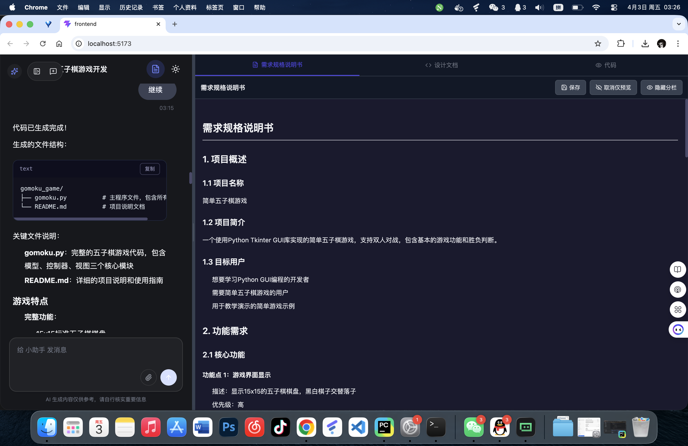
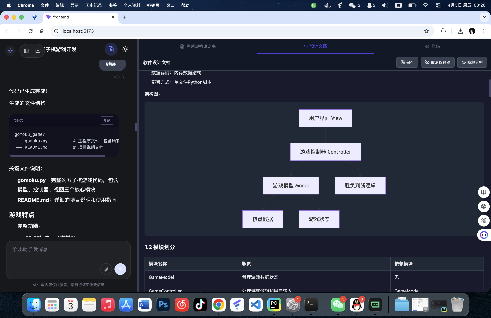
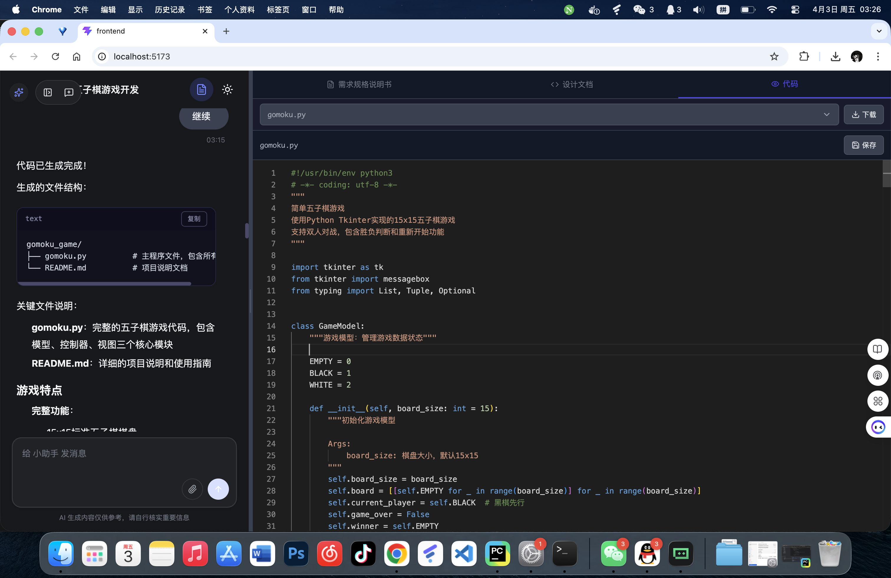

# HelloAgents

AI Agent 聊天应用，前后端分离架构。

## 项目结构

```
agent-demo/
├── backend/                 # FastAPI 后端
│   ├── app/
│   │   ├── api/v1/         # API 路由
│   │   ├── agents/         # Agent 实现
│   │   ├── models/         # 数据模型
│   │   ├── repositories/   # 数据访问层
│   │   └── services/       # 业务逻辑
│   ├── hello_agents/       # Agent 核心框架
│   ├── alembic/            # 数据库迁移
│   ├── requirements.txt    # Python 依赖
│   └── .env.example        # 环境变量示例
├── frontend/               # Vue 3 前端
│   ├── src/
│   │   ├── components/      # Vue 组件
│   │   ├── composables/     # 组合式函数
│   │   └── types/          # TypeScript 类型
│   └── package.json
└── README.md
```

## 环境要求

- Python 3.10+
- Node.js 18+
- MySQL 8.0+（可选，使用文件存储时不需要）

## 后端部署

### 1. 安装依赖

```bash
cd backend
pip install -r requirements.txt
```

### 2. 配置环境变量

复制 `.env.example` 为 `.env` 并配置：

```bash
cp .env.example .env
```

必填配置：

```env
LLM_API_KEY=your_api_key
LLM_MODEL_ID=deepseek-chat
LLM_BASE_URL=https://api.deepseek.com/v1
```

可选配置（会话存储）：

```env
SESSION_STORAGE_BACKEND=file  # file 或 mysql
# MySQL 配置（当 SESSION_STORAGE_BACKEND=mysql 时）
MYSQL_HOST=localhost
MYSQL_PORT=3306
MYSQL_USER=root
MYSQL_PASSWORD=123456
MYSQL_DATABASE=agents
```

### 3. 数据库迁移（如使用 MySQL）

```bash
cd backend
alembic upgrade head
```

### 4. 启动服务

```bash
cd backend
uvicorn app.main:app --reload --host localhost --port 8000
```

服务启动后：

- API 文档：<http://127.0.0.1:8000/docs>
- 在线调试页面：<http://127.0.0.1:8000/playground>

## 前端部署

### 1. 安装依赖

```bash
cd frontend
npm install
```

### 2. 配置（如需要）

创建 `.env` 文件配置后端地址：

```env
VITE_API_BASE_URL=http://127.0.0.1:8000
```

### 3. 开发模式

```bash
cd frontend
npm run dev
```

访问 <http://localhost:5173>

### 4. 生产构建

```bash
cd frontend
npm run build
```

构建产物在 `frontend/dist` 目录。

## 快速启动（开发模式）

### 后端 + 前端同时运行

终端 1 - 启动后端：

```bash
cd backend
pip install -r requirements.txt
uvicorn app.main:app --reload --host localhost --port 8000
```

终端 2 - 启动前端：

```bash
cd frontend
npm install
npm run dev
```

访问 <http://localhost:5173> 开始使用。

## API 接口

| 方法     | 路径                              | 说明        |
| ------ | ------------------------------- | --------- |
| GET    | /                               | 服务状态      |
| GET    | /api/v1/health                  | 健康检查      |
| POST   | /api/v1/sessions                | 创建会话      |
| GET    | /api/v1/sessions                | 会话列表      |
| GET    | /api/v1/sessions/{id}           | 会话详情      |
| GET    | /api/v1/sessions/{id}/history   | 历史消息      |
| POST   | /api/v1/sessions/{id}/reset     | 重置会话      |
| DELETE | /api/v1/sessions/{id}           | 删除会话      |
| POST   | /api/v1/chat/completions        | 对话        |
| POST   | /api/v1/chat/completions/stream | 流式对话（SSE） |

## 技术栈

**后端：**

- FastAPI - Web 框架
- SQLAlchemy - ORM
- Alembic - 数据库迁移
- hello\_agents - Agent 框架

**前端：**

- Vue 3 - 框架
- TypeScript - 语言
- Vite - 构建工具
- Tailwind CSS - 样式
- Monaco Editor - 代码编辑器

## 效果图





