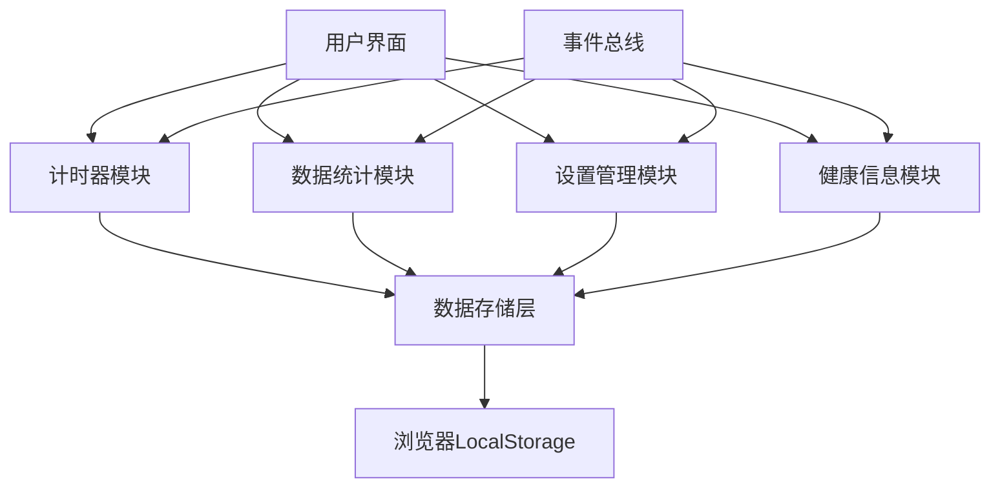
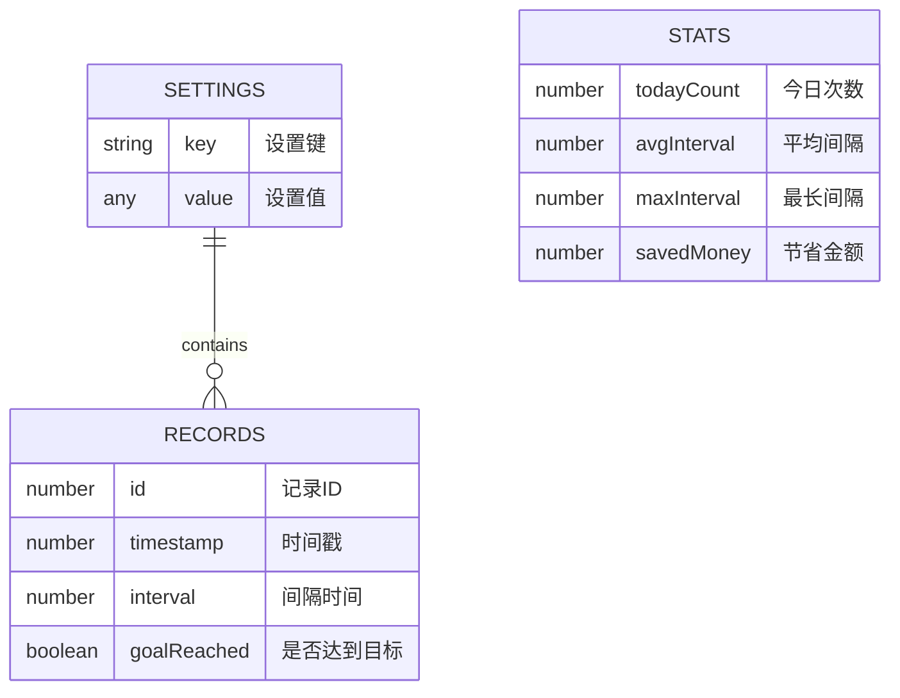
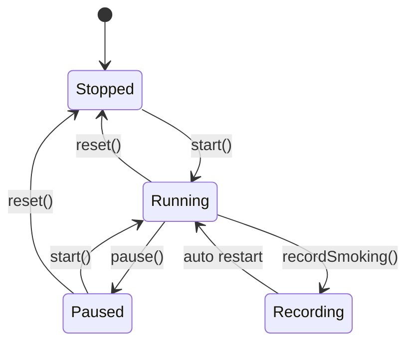
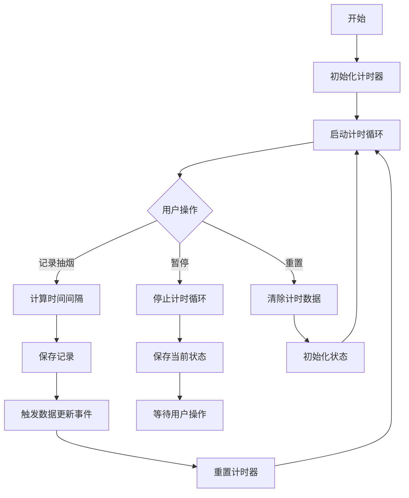
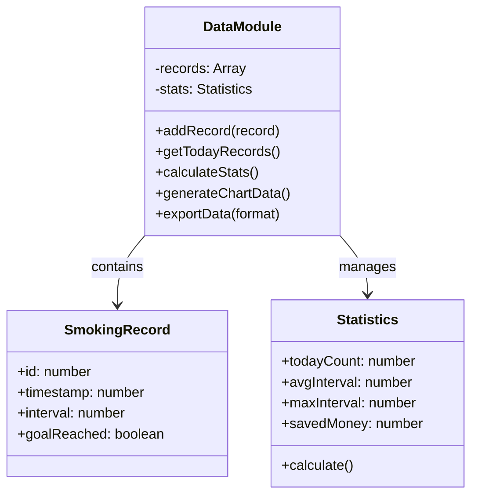

# 软件设计文档

## 1. 系统架构

### 1.1 整体架构

**架构说明**：这是一个纯前端的Web应用，所有功能都在浏览器中运行。应用使用HTML/CSS/JavaScript实现，数据存储在浏览器的LocalStorage中。采用模块化设计，将计时器、数据管理、UI控制等功能分离。

**技术栈**：
- 前端：HTML5, CSS3, JavaScript (ES6+)
- UI框架：原生CSS + 少量CSS Grid/Flexbox
- 图表库：Chart.js（用于数据可视化）
- 图标库：Font Awesome
- 字体：Google Fonts (Roboto)

**架构图**：


### 1.2 模块划分

| 模块名称 | 职责 | 依赖模块 |
|---------|------|----------|
| TimerModule | 计时器核心逻辑，时间计算，状态管理 | StorageModule, EventBus |
| DataModule | 数据统计计算，记录管理，图表生成 | StorageModule |
| SettingsModule | 用户设置管理，目标跟踪，提醒功能 | StorageModule, EventBus |
| HealthModule | 健康信息计算，戒烟进度，鼓励信息 | DataModule |
| UIModule | 界面渲染，用户交互处理，响应式适配 | 所有其他模块 |
| StorageModule | 数据持久化，LocalStorage操作 | 无 |
| EventBus | 模块间通信，事件发布订阅 | 无 |

### 1.3 项目目录结构

```
smoking-timer/
├── index.html              # 主页面
├── css/
│   ├── style.css          # 主样式文件
│   ├── components.css     # 组件样式
│   └── responsive.css     # 响应式样式
├── js/
│   ├── app.js             # 应用入口
│   ├── modules/
│   │   ├── timer.js       # 计时器模块
│   │   ├── data.js        # 数据模块
│   │   ├── settings.js    # 设置模块
│   │   ├── health.js      # 健康模块
│   │   ├── storage.js     # 存储模块
│   │   └── eventbus.js    # 事件总线
│   ├── ui/
│   │   ├── components.js  # UI组件
│   │   └── theme.js       # 主题管理
│   └── utils/
│       ├── time.js        # 时间工具函数
│       ├── math.js        # 数学计算函数
│       └── validation.js  # 验证函数
├── assets/
│   ├── sounds/            # 声音文件
│   └── icons/             # 图标文件
└── README.md              # 项目说明
```

## 2. API 设计

### 2.1 模块接口规范

**模块通信方式**：事件驱动架构，通过EventBus进行模块间通信

**通用事件格式**：
```javascript
{
  type: '事件类型',
  data: { /* 事件数据 */ },
  timestamp: Date.now()
}
```

### 2.2 核心事件接口

#### 2.2.1 计时器事件

**事件名称**：`timer:start`
触发时机：计时器开始运行
事件数据：
```javascript
{
  startTime: Date.now(),
  targetInterval: 7200 // 目标间隔（秒）
}
```

**事件名称**：`timer:stop`
触发时机：计时器停止
事件数据：
```javascript
{
  elapsedTime: 3600, // 经过的时间（秒）
  isManualStop: true // 是否手动停止
}
```

**事件名称**：`timer:record`
触发时机：记录一次抽烟
事件数据：
```javascript
{
  timestamp: Date.now(),
  interval: 3600, // 距离上次的时间间隔（秒）
  isGoalReached: true // 是否达到目标间隔
}
```

#### 2.2.2 数据事件

**事件名称**：`data:update`
触发时机：数据更新
事件数据：
```javascript
{
  todayCount: 3,
  avgInterval: 7200,
  maxInterval: 14400,
  savedMoney: 45.50
}
```

#### 2.2.3 设置事件

**事件名称**：`settings:change`
触发时机：用户修改设置
事件数据：
```javascript
{
  targetInterval: 7200,
  enableSound: true,
  enableNotifications: false,
  theme: 'light'
}
```

## 3. 数据库设计

### 3.1 数据存储结构

由于是纯前端应用，使用LocalStorage存储数据，结构如下：



### 3.2 LocalStorage键值设计

#### 键：`smoking_timer_settings`
值结构：
```json
{
  "targetInterval": 7200,
  "enableSound": true,
  "enableNotifications": false,
  "theme": "light",
  "cigarettePrice": 15,
  "cigarettesPerPack": 20,
  "lastResetDate": "2024-01-15"
}
```

#### 键：`smoking_timer_records`
值结构：
```json
[
  {
    "id": 1,
    "timestamp": 1673787600000,
    "interval": 7200,
    "goalReached": true
  },
  {
    "id": 2,
    "timestamp": 1673794800000,
    "interval": 3600,
    "goalReached": false
  }
]
```

#### 键：`smoking_timer_stats`
值结构：
```json
{
  "todayCount": 3,
  "avgInterval": 5400,
  "maxInterval": 14400,
  "totalSaved": 67.50,
  "lastUpdated": 1673798400000
}
```

## 4. 核心模块设计

### 4.1 计时器模块 (TimerModule)

**职责**：管理计时器状态，计算时间间隔，触发记录事件

**核心接口**：
```javascript
class TimerModule {
  // 开始计时
  start() -> void
  
  // 暂停计时
  pause() -> void
  
  // 重置计时器
  reset() -> void
  
  // 记录一次抽烟
  recordSmoking() -> SmokingRecord
  
  // 获取当前状态
  getStatus() -> { isRunning, elapsedTime, formattedTime }
}
```

**状态图**：


**流程图**：


### 4.2 数据模块 (DataModule)

**职责**：管理抽烟记录，计算统计数据，生成可视化图表

**核心接口**：
```javascript
class DataModule {
  // 添加新记录
  addRecord(record) -> void
  
  // 获取今日记录
  getTodayRecords() -> Array<SmokingRecord>
  
  // 计算统计数据
  calculateStats() -> Statistics
  
  // 生成图表数据
  generateChartData() -> ChartData
  
  // 导出数据
  exportData(format) -> Blob
}
```

**类图**：


### 4.3 健康信息模块 (HealthModule)

**职责**：计算健康改善信息，提供戒烟鼓励，显示进度

**核心算法**：
1. **节省金额计算**：
   ```
   节省金额 = 抽烟次数 × (香烟单价 ÷ 每包支数)
   ```

2. **健康改善计算**：
   ```
   肺部恢复进度 = (最长间隔时间 ÷ 目标间隔时间) × 100%
   ```

3. **成就系统**：
   - 青铜：连续3天达到目标间隔
   - 白银：连续7天达到目标间隔  
   - 黄金：连续30天达到目标间隔
   - 钻石：连续90天达到目标间隔

### 4.4 UI模块设计

**响应式布局策略**：
- 移动端（<768px）：单列布局，简化控件
- 平板端（768px-1024px）：两列布局
- 桌面端（>1024px）：三列布局

**主题系统**：
- 浅色主题：适合白天使用
- 深色主题：适合夜间使用，减少眼睛疲劳
- 健康主题：绿色系，强调健康概念

## 5. 性能优化设计

### 5.1 计时器优化
- 使用 `requestAnimationFrame` 实现平滑动画
- 减少DOM操作，批量更新UI
- 使用Web Workers处理复杂计算（可选）

### 5.2 数据存储优化
- 定期清理过期记录（保留最近30天）
- 使用IndexedDB替代LocalStorage处理大量数据（扩展功能）
- 实现数据压缩存储

### 5.3 加载优化
- 懒加载非关键资源
- 使用Service Worker实现离线功能
- 资源预加载和缓存策略