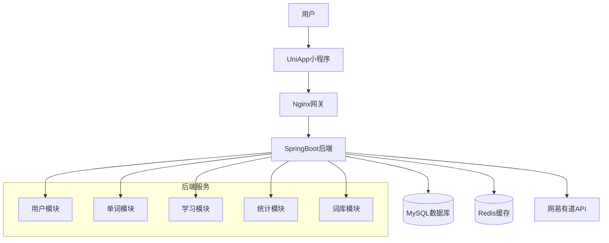
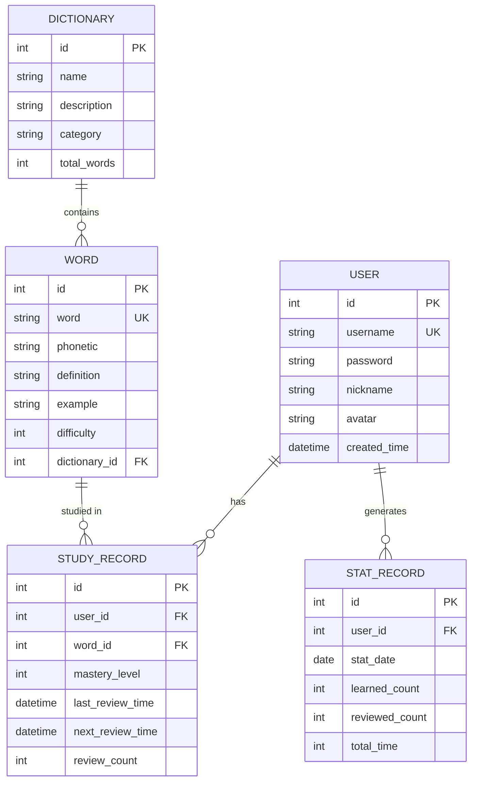
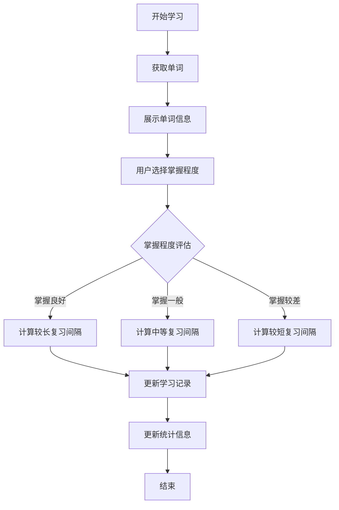
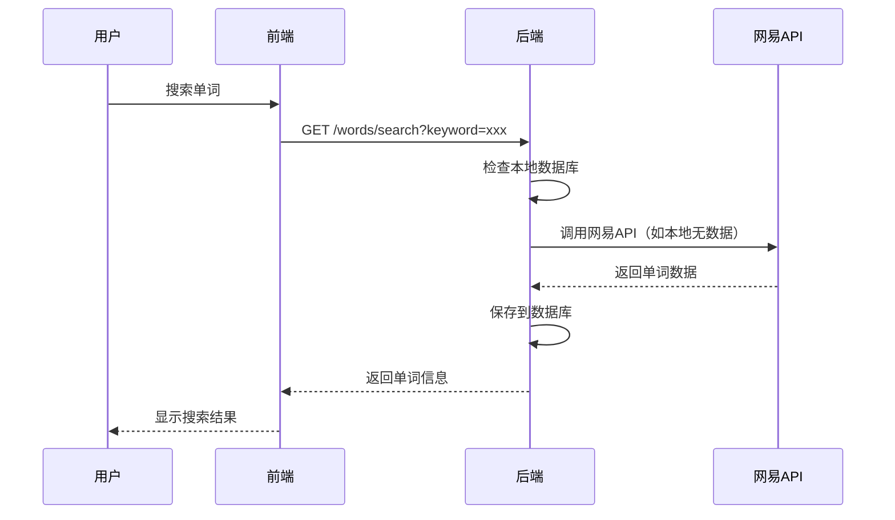

# 软件设计文档

## 1. 系统架构

### 1.1 整体架构

**架构说明**：系统采用前后端分离架构，后端使用SpringBoot提供RESTful API，前端使用UniApp开发跨平台小程序。系统包含用户管理、单词学习、智能复习、词库管理、学习统计等核心模块。

**技术栈**：
- 前端：UniApp + Vue3 + uView UI
- 后端：SpringBoot 3.x + MyBatis Plus + Spring Security
- 数据库：MySQL 8.0
- 缓存：Redis 7.x
- 外部接口：网易有道词典API

**架构图**：


### 1.2 模块划分

| 模块名称 | 职责 | 依赖模块 |
|---------|------|----------|
| 用户模块 | 用户注册、登录、个人信息管理 | 无 |
| 单词模块 | 单词信息管理、单词搜索 | 外部API模块 |
| 学习模块 | 单词学习、智能复习、学习记录 | 用户模块、单词模块 |
| 词库模块 | 词库管理、词库进度跟踪 | 单词模块、学习模块 |
| 统计模块 | 学习数据统计、报表生成 | 学习模块 |
| 外部API模块 | 调用网易有道词典API | 无 |

### 1.3 项目目录结构

```
wordmaster-backend/
├── src/main/java/com/wordmaster/
│   ├── WordMasterApplication.java
│   ├── config/
│   │   ├── SecurityConfig.java
│   │   ├── RedisConfig.java
│   │   └── WebConfig.java
│   ├── controller/
│   │   ├── AuthController.java
│   │   ├── UserController.java
│   │   ├── WordController.java
│   │   ├── StudyController.java
│   │   ├── DictionaryController.java
│   │   └── StatController.java
│   ├── service/
│   │   ├── impl/
│   │   │   ├── UserServiceImpl.java
│   │   │   ├── WordServiceImpl.java
│   │   │   ├── StudyServiceImpl.java
│   │   │   ├── DictionaryServiceImpl.java
│   │   │   └── StatServiceImpl.java
│   │   ├── UserService.java
│   │   ├── WordService.java
│   │   ├── StudyService.java
│   │   ├── DictionaryService.java
│   │   └── StatService.java
│   ├── mapper/
│   │   ├── UserMapper.java
│   │   ├── WordMapper.java
│   │   ├── StudyRecordMapper.java
│   │   ├── DictionaryMapper.java
│   │   └── StatMapper.java
│   ├── entity/
│   │   ├── User.java
│   │   ├── Word.java
│   │   ├── StudyRecord.java
│   │   ├── Dictionary.java
│   │   └── StatRecord.java
│   ├── dto/
│   │   ├── request/
│   │   │   ├── LoginRequest.java
│   │   │   ├── RegisterRequest.java
│   │   │   └── StudyRequest.java
│   │   └── response/
│   │       ├── ApiResponse.java
│   │       ├── UserResponse.java
│   │       └── WordResponse.java
│   ├── util/
│   │   ├── JwtUtil.java
│   │   ├── RedisUtil.java
│   │   ├── ForgettingCurveUtil.java
│   │   └── NeteaseApiClient.java
│   └── exception/
│       ├── GlobalExceptionHandler.java
│       └── BusinessException.java
├── src/main/resources/
│   ├── application.yml
│   ├── mapper/
│   └── static/
├── src/test/
├── Dockerfile
├── docker-compose.yml
├── pom.xml
└── README.md

wordmaster-frontend/
├── pages/
│   ├── login/
│   │   └── login.vue
│   ├── index/
│   │   └── index.vue
│   ├── study/
│   │   └── study.vue
│   ├── review/
│   │   └── review.vue
│   ├── dictionary/
│   │   └── dictionary.vue
│   ├── statistics/
│   │   └── statistics.vue
│   └── profile/
│       └── profile.vue
├── components/
│   ├── word-card.vue
│   ├── study-progress.vue
│   └── stat-chart.vue
├── store/
│   └── user.js
├── api/
│   ├── request.js
│   └── api.js
├── utils/
│   ├── auth.js
│   └── common.js
├── static/
├── manifest.json
├── pages.json
├── App.vue
├── main.js
└── uni.scss
```

## 2. API 设计

### 2.1 接口规范

**Base URL**: `/api/v1`

**通用规范**：
- 认证方式：Bearer Token（JWT）
- 通用请求头：`Content-Type: application/json`
- 通用响应格式：

```json
{
  "code": 0,
  "message": "success",
  "data": {},
  "timestamp": 1630000000000
}
```

**错误码定义**：
- 0: 成功
- 1000-1999: 用户相关错误
- 2000-2999: 单词相关错误
- 3000-3999: 学习相关错误
- 4000-4999: 系统错误

### 2.2 接口列表

#### 2.2.1 用户认证模块

**接口名称**：POST `/auth/register`

请求参数：

| 参数名 | 类型 | 必填 | 说明 |
|--------|------|------|------|
| username | string | 是 | 用户名 |
| password | string | 是 | 密码 |
| nickname | string | 否 | 昵称 |

请求示例：
```json
{
  "username": "testuser",
  "password": "password123",
  "nickname": "测试用户"
}
```

响应示例：
```json
{
  "code": 0,
  "message": "注册成功",
  "data": {
    "id": 1,
    "username": "testuser",
    "nickname": "测试用户",
    "token": "eyJhbGciOiJIUzI1NiIsInR5cCI6IkpXVCJ9..."
  }
}
```

**接口名称**：POST `/auth/login`

请求参数：

| 参数名 | 类型 | 必填 | 说明 |
|--------|------|------|------|
| username | string | 是 | 用户名 |
| password | string | 是 | 密码 |

响应示例：
```json
{
  "code": 0,
  "message": "登录成功",
  "data": {
    "id": 1,
    "username": "testuser",
    "nickname": "测试用户",
    "token": "eyJhbGciOiJIUzI1NiIsInR5cCI6IkpXVCJ9..."
  }
}
```

#### 2.2.2 单词模块

**接口名称**：GET `/words/{id}`

请求参数：

| 参数名 | 类型 | 必填 | 说明 |
|--------|------|------|------|
| id | int | 是 | 单词ID |

响应示例：
```json
{
  "code": 0,
  "message": "success",
  "data": {
    "id": 1,
    "word": "abandon",
    "phonetic": "/əˈbændən/",
    "definition": "v. 放弃，抛弃",
    "example": "He abandoned his car and continued on foot.",
    "difficulty": 3
  }
}
```

**接口名称**：GET `/words/search`

请求参数：

| 参数名 | 类型 | 必填 | 说明 |
|--------|------|------|------|
| keyword | string | 是 | 搜索关键词 |
| page | int | 否 | 页码，默认1 |
| size | int | 否 | 每页大小，默认10 |

#### 2.2.3 学习模块

**接口名称**：POST `/study/learn`

请求参数：

| 参数名 | 类型 | 必填 | 说明 |
|--------|------|------|------|
| wordId | int | 是 | 单词ID |
| mastery | int | 是 | 掌握程度（1-5） |

**接口名称**：GET `/study/review-list`

请求参数：无（从token获取用户ID）

响应示例：
```json
{
  "code": 0,
  "message": "success",
  "data": {
    "total": 15,
    "words": [
      {
        "id": 1,
        "word": "abandon",
        "phonetic": "/əˈbændən/",
        "definition": "v. 放弃，抛弃",
        "lastReviewTime": "2023-10-01 10:00:00",
        "nextReviewTime": "2023-10-02 10:00:00",
        "reviewCount": 2
      }
    ]
  }
}
```

#### 2.2.4 词库模块

**接口名称**：GET `/dictionaries`

请求参数：无

响应示例：
```json
{
  "code": 0,
  "message": "success",
  "data": [
    {
      "id": 1,
      "name": "四级核心词汇",
      "description": "大学英语四级考试核心词汇",
      "totalWords": 3000,
      "learnedWords": 150,
      "progress": 5.0
    }
  ]
}
```

#### 2.2.5 统计模块

**接口名称**：GET `/stats/daily`

请求参数：

| 参数名 | 类型 | 必填 | 说明 |
|--------|------|------|------|
| date | string | 否 | 日期（yyyy-MM-dd），默认今天 |

**接口名称**：GET `/stats/trend`

请求参数：

| 参数名 | 类型 | 必填 | 说明 |
|--------|------|------|------|
| type | string | 是 | 统计类型（day/week/month） |
| days | int | 否 | 天数，默认7 |

## 3. 数据库设计

### 3.1 ER 图



### 3.2 表结构

#### 表名：`user`

| 字段名 | 类型 | 主键 | 索引 | 说明 |
|--------|------|------|------|------|
| id | INT | PK | AUTO_INCREMENT | 用户ID |
| username | VARCHAR(50) | - | UNIQUE | 用户名 |
| password | VARCHAR(100) | - | - | 密码（BCrypt加密） |
| nickname | VARCHAR(50) | - | - | 昵称 |
| avatar | VARCHAR(200) | - | - | 头像URL |
| created_time | DATETIME | - | - | 创建时间 |

DDL：
```sql
CREATE TABLE `user` (
  `id` INT AUTO_INCREMENT PRIMARY KEY,
  `username` VARCHAR(50) NOT NULL UNIQUE,
  `password` VARCHAR(100) NOT NULL,
  `nickname` VARCHAR(50),
  `avatar` VARCHAR(200),
  `created_time` DATETIME DEFAULT CURRENT_TIMESTAMP,
  INDEX `idx_username` (`username`)
) ENGINE=InnoDB DEFAULT CHARSET=utf8mb4 COLLATE=utf8mb4_unicode_ci;
```

#### 表名：`word`

| 字段名 | 类型 | 主键 | 索引 | 说明 |
|--------|------|------|------|------|
| id | INT | PK | AUTO_INCREMENT | 单词ID |
| word | VARCHAR(100) | - | UNIQUE | 单词 |
| phonetic | VARCHAR(100) | - | - | 音标 |
| definition | TEXT | - | - | 释义 |
| example | TEXT | - | - | 例句 |
| difficulty | TINYINT | - | - | 难度等级（1-5） |
| dictionary_id | INT | - | INDEX | 所属词库ID |

DDL：
```sql
CREATE TABLE `word` (
  `id` INT AUTO_INCREMENT PRIMARY KEY,
  `word` VARCHAR(100) NOT NULL UNIQUE,
  `phonetic` VARCHAR(100),
  `definition` TEXT,
  `example` TEXT,
  `difficulty` TINYINT DEFAULT 3,
  `dictionary_id` INT,
  INDEX `idx_word` (`word`),
  INDEX `idx_dictionary` (`dictionary_id`)
) ENGINE=InnoDB DEFAULT CHARSET=utf8mb4 COLLATE=utf8mb4_unicode_ci;
```

#### 表名：`study_record`

| 字段名 | 类型 | 主键 | 索引 | 说明 |
|--------|------|------|------|------|
| id | INT | PK | AUTO_INCREMENT | 记录ID |
| user_id | INT | - | INDEX | 用户ID |
| word_id | INT | - | INDEX | 单词ID |
| mastery_level | TINYINT | - | - | 掌握程度（1-5） |
| last_review_time | DATETIME | - | - | 上次复习时间 |
| next_review_time | DATETIME | - | - | 下次复习时间 |
| review_count | INT | - | - | 复习次数 |
| created_time | DATETIME | - | - | 创建时间 |

DDL：
```sql
CREATE TABLE `study_record` (
  `id` INT AUTO_INCREMENT PRIMARY KEY,
  `user_id` INT NOT NULL,
  `word_id` INT NOT NULL,
  `mastery_level` TINYINT DEFAULT 1,
  `last_review_time` DATETIME DEFAULT CURRENT_TIMESTAMP,
  `next_review_time` DATETIME,
  `review_count` INT DEFAULT 0,
  `created_time` DATETIME DEFAULT CURRENT_TIMESTAMP,
  UNIQUE KEY `uk_user_word` (`user_id`, `word_id`),
  INDEX `idx_user` (`user_id`),
  INDEX `idx_word` (`word_id`),
  INDEX `idx_next_review` (`next_review_time`),
  FOREIGN KEY (`user_id`) REFERENCES `user`(`id`) ON DELETE CASCADE,
  FOREIGN KEY (`word_id`) REFERENCES `word`(`id`) ON DELETE CASCADE
) ENGINE=InnoDB DEFAULT CHARSET=utf8mb4 COLLATE=utf8mb4_unicode_ci;
```

#### 表名：`dictionary`

| 字段名 | 类型 | 主键 | 索引 | 说明 |
|--------|------|------|------|------|
| id | INT | PK | AUTO_INCREMENT | 词库ID |
| name | VARCHAR(100) | - | - | 词库名称 |
| description | TEXT | - | - | 描述 |
| category | VARCHAR(50) | - | INDEX | 分类 |
| total_words | INT | - | - | 总单词数 |

DDL：
```sql
CREATE TABLE `dictionary` (
  `id` INT AUTO_INCREMENT PRIMARY KEY,
  `name` VARCHAR(100) NOT NULL,
  `description` TEXT,
  `category` VARCHAR(50),
  `total_words` INT DEFAULT 0,
  INDEX `idx_category` (`category`)
) ENGINE=InnoDB DEFAULT CHARSET=utf8mb4 COLLATE=utf8mb4_unicode_ci;
```

#### 表名：`stat_record`

| 字段名 | 类型 | 主键 | 索引 | 说明 |
|--------|------|------|------|------|
| id | INT | PK | AUTO_INCREMENT | 统计ID |
| user_id | INT | - | INDEX | 用户ID |
| stat_date | DATE | - | - | 统计日期 |
| learned_count | INT | - | - | 学习单词数 |
| reviewed_count | INT | - | - | 复习单词数 |
| total_time | INT | - | - | 总学习时间（分钟） |

DDL：
```sql
CREATE TABLE `stat_record` (
  `id` INT AUTO_INCREMENT PRIMARY KEY,
  `user_id` INT NOT NULL,
  `stat_date` DATE NOT NULL,
  `learned_count` INT DEFAULT 0,
  `reviewed_count` INT DEFAULT 0,
  `total_time` INT DEFAULT 0,
  UNIQUE KEY `uk_user_date` (`user_id`, `stat_date`),
  INDEX `idx_user_date` (`user_id`, `stat_date`),
  FOREIGN KEY (`user_id`) REFERENCES `user`(`id`) ON DELETE CASCADE
) ENGINE=InnoDB DEFAULT CHARSET=utf8mb4 COLLATE=utf8mb4_unicode_ci;
```

### 3.3 数据库初始化脚本

```sql
-- wordmaster_database_init.sql
-- 创建数据库
CREATE DATABASE IF NOT EXISTS wordmaster DEFAULT CHARACTER SET utf8mb4 COLLATE utf8mb4_unicode_ci;
USE wordmaster;

-- 用户表
CREATE TABLE `user` (
  `id` INT AUTO_INCREMENT PRIMARY KEY,
  `username` VARCHAR(50) NOT NULL UNIQUE,
  `password` VARCHAR(100) NOT NULL,
  `nickname` VARCHAR(50),
  `avatar` VARCHAR(200),
  `created_time` DATETIME DEFAULT CURRENT_TIMESTAMP,
  INDEX `idx_username` (`username`)
) ENGINE=InnoDB DEFAULT CHARSET=utf8mb4 COLLATE=utf8mb4_unicode_ci;

-- 词库表
CREATE TABLE `dictionary` (
  `id` INT AUTO_INCREMENT PRIMARY KEY,
  `name` VARCHAR(100) NOT NULL,
  `description` TEXT,
  `category` VARCHAR(50),
  `total_words` INT DEFAULT 0,
  INDEX `idx_category` (`category`)
) ENGINE=InnoDB DEFAULT CHARSET=utf8mb4 COLLATE=utf8mb4_unicode_ci;

-- 单词表
CREATE TABLE `word` (
  `id` INT AUTO_INCREMENT PRIMARY KEY,
  `word` VARCHAR(100) NOT NULL UNIQUE,
  `phonetic` VARCHAR(100),
  `definition` TEXT,
  `example` TEXT,
  `difficulty` TINYINT DEFAULT 3,
  `dictionary_id` INT,
  INDEX `idx_word` (`word`),
  INDEX `idx_dictionary` (`dictionary_id`),
  FOREIGN KEY (`dictionary_id`) REFERENCES `dictionary`(`id`) ON DELETE SET NULL
) ENGINE=InnoDB DEFAULT CHARSET=utf8mb4 COLLATE=utf8mb4_unicode_ci;

-- 学习记录表
CREATE TABLE `study_record` (
  `id` INT AUTO_INCREMENT PRIMARY KEY,
  `user_id` INT NOT NULL,
  `word_id` INT NOT NULL,
  `mastery_level` TINYINT DEFAULT 1,
  `last_review_time` DATETIME DEFAULT CURRENT_TIMESTAMP,
  `next_review_time` DATETIME,
  `review_count` INT DEFAULT 0,
  `created_time` DATETIME DEFAULT CURRENT_TIMESTAMP,
  UNIQUE KEY `uk_user_word` (`user_id`, `word_id`),
  INDEX `idx_user` (`user_id`),
  INDEX `idx_word` (`word_id`),
  INDEX `idx_next_review` (`next_review_time`),
  FOREIGN KEY (`user_id`) REFERENCES `user`(`id`) ON DELETE CASCADE,
  FOREIGN KEY (`word_id`) REFERENCES `word`(`id`) ON DELETE CASCADE
) ENGINE=InnoDB DEFAULT CHARSET=utf8mb4 COLLATE=utf8mb4_unicode_ci;

-- 统计记录表
CREATE TABLE `stat_record` (
  `id` INT AUTO_INCREMENT PRIMARY KEY,
  `user_id` INT NOT NULL,
  `stat_date` DATE NOT NULL,
  `learned_count` INT DEFAULT 0,
  `reviewed_count` INT DEFAULT 0,
  `total_time` INT DEFAULT 0,
  UNIQUE KEY `uk_user_date` (`user_id`, `stat_date`),
  INDEX `idx_user_date` (`user_id`, `stat_date`),
  FOREIGN KEY (`user_id`) REFERENCES `user`(`id`) ON DELETE CASCADE
) ENGINE=InnoDB DEFAULT CHARSET=utf8mb4 COLLATE=utf8mb4_unicode_ci;

-- 插入初始词库数据
INSERT INTO `dictionary` (`name`, `description`, `category`, `total_words`) VALUES
('四级核心词汇', '大学英语四级考试核心词汇', 'CET4', 3000),
('六级核心词汇', '大学英语六级考试核心词汇', 'CET6', 3500),
('考研英语词汇', '研究生入学考试英语词汇', 'POSTGRADUATE', 5500),
('托福核心词汇', 'TOEFL考试核心词汇', 'TOEFL', 4000),
('雅思核心词汇', 'IELTS考试核心词汇', 'IELTS', 4500),
('商务英语词汇', '商务场景常用英语词汇', 'BUSINESS', 2000),
('日常口语词汇', '日常生活口语常用词汇', 'DAILY', 1500);

-- 插入示例单词数据（实际使用时从网易API获取）
INSERT INTO `word` (`word`, `phonetic`, `definition`, `example`, `difficulty`, `dictionary_id`) VALUES
('abandon', '/əˈbændən/', 'v. 放弃，抛弃', 'He abandoned his car and continued on foot.', 3, 1),
('ability', '/əˈbɪləti/', 'n. 能力，才能', 'She has the ability to speak four languages.', 2, 1),
('abroad', '/əˈbrɔːd/', 'adv. 在国外，到国外', 'He studied abroad for two years.', 2, 1),
('absence', '/ˈæbsəns/', 'n. 缺席，不在', 'His absence from the meeting was noticed.', 3, 1),
('absolute', '/ˈæbsəluːt/', 'adj. 绝对的，完全的', 'I have absolute confidence in her.', 4, 1),
('absorb', '/əbˈzɔːrb/', 'v. 吸收，吸引', 'Plants absorb carbon dioxide.', 3, 1),
('abstract', '/ˈæbstrækt/', 'adj. 抽象的', 'Abstract ideas can be difficult to understand.', 4, 1),
('abundant', '/əˈbʌndənt/', 'adj. 丰富的，充裕的', 'The region has abundant natural resources.', 3, 1),
('academic', '/ˌækəˈdemɪk/', 'adj. 学术的，学院的', 'She has an academic background in physics.', 3, 1),
('accelerate', '/əkˈseləreɪt/', 'v. 加速，促进', 'The car accelerated quickly.', 4, 1);

-- 创建测试用户（密码：test123）
INSERT INTO `user` (`username`, `password`, `nickname`) VALUES
('testuser', '$2a$10$N.zmdr9k7uOCQb376NoUnuTJ8iAt6Z5EHsM8lE9lBOsl7iKTV5UiC', '测试用户');

-- 创建学习记录示例
INSERT INTO `study_record` (`user_id`, `word_id`, `mastery_level`, `last_review_time`, `next_review_time`, `review_count`) VALUES
(1, 1, 3, '2023-10-01 10:00:00', '2023-10-02 10:00:00', 2),
(1, 2, 4, '2023-10-01 11:00:00', '2023-10-03 11:00:00', 1),
(1, 3, 2, '2023-10-01 12:00:00', '2023-10-01 18:00:00', 3);

-- 创建统计记录示例
INSERT INTO `stat_record` (`user_id`, `stat_date`, `learned_count`, `reviewed_count`, `total_time`) VALUES
(1, '2023-10-01', 10, 15, 45),
(1, '2023-09-30', 8, 12, 40),
(1, '2023-09-29', 12, 18, 55);
```

## 4. 核心模块设计

### 4.1 学习模块

**职责**：管理用户学习过程，包括单词学习、复习算法、学习记录管理

**核心算法**：基于艾宾浩斯遗忘曲线的复习算法



**遗忘曲线算法实现**：
```java
public class ForgettingCurveUtil {
    // 根据掌握程度和复习次数计算下次复习时间间隔（小时）
    public static int calculateNextReviewInterval(int masteryLevel, int reviewCount) {
        // 基础间隔（小时）
        int baseInterval;
        
        switch (masteryLevel) {
            case 1: // 完全不会
                baseInterval = 1;  // 1小时后复习
                break;
            case 2: // 有点印象
                baseInterval = 6;  // 6小时后复习
                break;
            case 3: // 基本掌握
                baseInterval = 24; // 1天后复习
                break;
            case 4: // 熟练掌握
                baseInterval = 72; // 3天后复习
                break;
            case 5: // 完全掌握
                baseInterval = 168; // 7天后复习
                break;
            default:
                baseInterval = 24;
        }
        
        // 根据复习次数调整间隔（复习次数越多，间隔越长）
        double factor = Math.pow(1.5, Math.min(reviewCount, 10));
        return (int) (baseInterval * factor);
    }
}
```

### 4.2 外部API模块

**职责**：调用网易有道词典API获取单词详细信息

**接口调用流程**：


**网易API客户端实现**：
```java
@Component
public class NeteaseApiClient {
    
    @Value("${netease.api.key}")
    private String apiKey;
    
    @Value("${netease.api.secret}")
    private String apiSecret;
    
    public WordResponse getWordDetail(String word) {
        // 构建请求
        String url = "https://dict.youdao.com/jsonapi";
        
        // 设置请求参数
        Map<String, String> params = new HashMap<>();
        params.put("q", word);
        params.put("key", apiKey);
        
        // 发送请求并解析响应
        // 实际实现中需要处理HTTP请求和JSON解析
        
        return parseResponse(response);
    }
    
    private WordResponse parseResponse(String response) {
        // 解析网易API返回的JSON数据
        // 提取单词、音标、释义、例句等信息
        return wordResponse;
    }
}
```

### 4.3 统计模块

**职责**：收集和分析用户学习数据，生成统计报告

**数据收集时机**：
1. 用户完成单词学习时
2. 用户完成复习时
3. 每日定时任务汇总

**统计维度**：
- 每日学习数据（学习单词数、复习单词数、学习时长）
- 学习趋势分析（日/周/月）
- 掌握程度分布
- 词库学习进度

### 4.4 安全模块

**职责**：用户认证和权限控制

**实现方案**：
- 使用JWT（JSON Web Token）进行无状态认证
- 密码使用BCrypt加密存储
- 接口级权限控制（Spring Security）
- 防止SQL注入和XSS攻击

```java
@Configuration
@EnableWebSecurity
public class SecurityConfig {
    
    @Bean
    public SecurityFilterChain filterChain(HttpSecurity http) throws Exception {
        http
            .csrf().disable()
            .authorizeHttpRequests(auth -> auth
                .requestMatchers("/api/v1/auth/**").permitAll()
                .requestMatchers("/api/v1/words/search").permitAll()
                .anyRequest().authenticated()
            )
            .addFilterBefore(jwtAuthenticationFilter(), UsernamePasswordAuthenticationFilter.class)
            .sessionManagement().sessionCreationPolicy(SessionCreationPolicy.STATELESS);
        
        return http.build();
    }
    
    @Bean
    public JwtAuthenticationFilter jwtAuthenticationFilter() {
        return new JwtAuthenticationFilter();
    }
}
```

## 5. 部署设计

### 5.1 Docker部署配置

**docker-compose.yml**：
```yaml
version: '3.8'

services:
  mysql:
    image: mysql:8.0
    container_name: wordmaster-mysql
    environment:
      MYSQL_ROOT_PASSWORD: rootpassword
      MYSQL_DATABASE: wordmaster
      MYSQL_USER: wordmaster
      MYSQL_PASSWORD: wordmaster123
    ports:
      - "3306:3306"
    volumes:
      - mysql_data:/var/lib/mysql
      - ./init.sql:/docker-entrypoint-initdb.d/init.sql
    networks:
      - wordmaster-network

  redis:
    image: redis:7-alpine
    container_name: wordmaster-redis
    ports:
      - "6379:6379"
    volumes:
      - redis_data:/data
    networks:
      - wordmaster-network

  backend:
    build: ./wordmaster-backend
    container_name: wordmaster-backend
    depends_on:
      - mysql
      - redis
    environment:
      SPRING_DATASOURCE_URL: jdbc:mysql://mysql:3306/wordmaster
      SPRING_DATASOURCE_USERNAME: wordmaster
      SPRING_DATASOURCE_PASSWORD: wordmaster123
      SPRING_REDIS_HOST: redis
      SPRING_REDIS_PORT: 6379
    ports:
      - "8080:8080"
    networks:
      - wordmaster-network

  nginx:
    image: nginx:alpine
    container_name: wordmaster-nginx
    depends_on:
      - backend
    ports:
      - "80:80"
    volumes:
      - ./nginx.conf:/etc/nginx/nginx.conf
      - ./wordmaster-frontend/dist:/usr/share/nginx/html
    networks:
      - wordmaster-network

volumes:
  mysql_data:
  redis_data:

networks:
  wordmaster-network:
    driver: bridge
```

### 5.2 环境配置

**application.yml**：
```yaml
spring:
  datasource:
    url: jdbc:mysql://localhost:3306/wordmaster
    username: wordmaster
    password: wordmaster123
    driver-class-name: com.mysql.cj.jdbc.Driver
  redis:
    host: localhost
    port: 6379
    database: 0
  jackson:
    date-format: yyyy-MM-dd HH:mm:ss
    time-zone: GMT+8

jwt:
  secret: wordmaster-jwt-secret-key-2023
  expiration: 86400000  # 24小时

netease:
  api:
    key: ${NETEASE_API_KEY}
    secret: ${NETEASE_API_SECRET}

server:
  port: 8080
  servlet:
    context-path: /api
```

## 6. 开发计划

### 6.1 开发阶段

**第一阶段（1-2周）**：
- 数据库设计和初始化
- 用户管理模块开发
- 基础框架搭建

**第二阶段（2-3周）**：
- 单词模块开发
- 学习模块核心功能
- 外部API集成

**第三阶段（1-2周）**：
- 统计模块开发
- 前端页面开发
- 测试和优化

**第四阶段（1周）**：
- 部署配置
- 文档编写
- 上线准备

### 6.2 测试策略

**单元测试**：使用JUnit + Mockito测试业务逻辑
**集成测试**：测试API接口和数据库交互
**性能测试**：使用JMeter测试并发性能
**安全测试**：检查SQL注入、XSS等安全漏洞