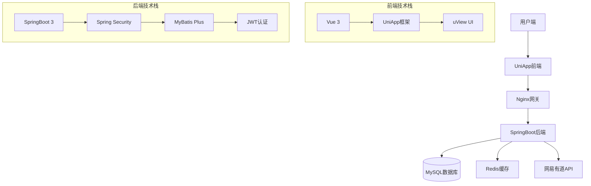
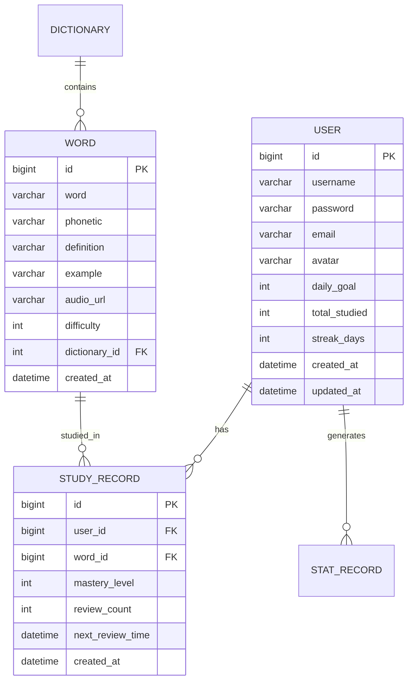

# WordMaster - 智能背单词小程序


## 📖 项目简介

WordMaster 是一个基于 SpringBoot + UniApp 的智能背单词小程序，集成了多种学习模式、智能复习算法和丰富的单词资源。项目采用前后端分离架构，支持跨平台部署（微信小程序、H5、App等）。

## ✨ 核心特性

### 🎯 智能学习
- **多种学习模式**: 卡片学习、选择题测试、拼写测试
- **遗忘曲线算法**: 基于艾宾浩斯遗忘曲线的智能复习系统
- **个性化推荐**: 根据学习进度推荐适合的单词

### 📚 丰富词库
- **多类别词库**: 四级、六级、考研、托福、雅思等
- **实时查询**: 集成网易有道API，实时获取单词详细信息
- **发音功能**: 支持单词发音（英音/美音）

### 📊 学习统计
- **数据可视化**: 图表展示学习进度和趋势
- **学习报告**: 每日/每周/每月学习统计
- **成就系统**: 连续学习天数、掌握单词数等

### 🔧 技术特性
- **前后端分离**: SpringBoot后端 + UniApp前端
- **JWT认证**: 安全的用户认证机制
- **Redis缓存**: 提升系统性能
- **Docker支持**: 容器化部署
- **RESTful API**: 规范的接口设计

## 🏗️ 系统架构



## 📁 项目结构

### 后端项目结构
```
wordmaster-backend/
├── src/main/java/com/wordmaster/
│   ├── WordMasterApplication.java          # 应用主类
│   ├── config/                             # 配置类
│   ├── controller/                         # 控制器层（6个控制器）
│   ├── service/                           # 服务层（5个服务）
│   ├── mapper/                            # 数据访问层
│   ├── entity/                            # 实体类（5个实体）
│   ├── dto/                               # 数据传输对象
│   ├── util/                              # 工具类
│   └── exception/                         # 异常处理
├── src/main/resources/
│   ├── application.yml                    # 应用配置
│   └── db/init.sql                        # 数据库初始化脚本
└── pom.xml                                # Maven配置
```

### 前端项目结构
```
wordmaster-frontend/
├── pages/                                 # 页面文件（8个页面）
│   ├── login/                            # 登录页
│   ├── index/                            # 首页
│   ├── study/                            # 学习页
│   ├── review/                           # 复习页
│   ├── dictionary/                       # 词库页
│   ├── statistics/                       # 统计页
│   ├── profile/                          # 个人中心
│   └── search/                           # 搜索页
├── api/                                   # API相关
│   ├── request.js                        # 请求工具
│   └── api.js                            # API接口定义
├── static/                                # 静态资源
├── App.vue                               # 应用主文件
├── main.js                               # 入口文件
├── pages.json                            # 页面配置
└── manifest.json                         # 应用配置
```

## 🚀 快速开始

### 环境要求

- **JDK**: 17+
- **MySQL**: 8.0+
- **Redis**: 7.0+
- **Maven**: 3.6+
- **Node.js**: 16+
- **HBuilderX** 或 **VSCode**（前端开发）

### 后端部署步骤

1. **克隆项目**
```bash
git clone <repository-url>
cd wordmaster-backend
```

2. **数据库初始化**
```bash
# 创建数据库
mysql -u root -p -e "CREATE DATABASE wordmaster CHARACTER SET utf8mb4 COLLATE utf8mb4_unicode_ci;"

# 执行初始化脚本
mysql -u root -p wordmaster < src/main/resources/db/init.sql
```

3. **修改配置文件**
编辑 `src/main/resources/application.yml`：
```yaml
spring:
  datasource:
    url: jdbc:mysql://localhost:3306/wordmaster?useSSL=false&serverTimezone=Asia/Shanghai
    username: your_username
    password: your_password
  redis:
    host: localhost
    port: 6379
    password: your_redis_password
```

4. **构建并运行**
```bash
# 使用Maven构建
mvn clean package

# 运行项目
java -jar target/wordmaster-backend-1.0.0.jar

# 或者直接运行
mvn spring-boot:run
```

5. **验证运行**
访问以下地址验证：
- 应用主页: http://localhost:8080
- API文档: http://localhost:8080/api/swagger-ui.html
- 健康检查: http://localhost:8080/api/actuator/health

### 前端部署步骤

1. **安装依赖**
```bash
cd wordmaster-frontend
npm install
```

2. **配置API地址**
编辑 `api/request.js`：
```javascript
const baseURL = 'http://localhost:8080/api/v1'
```

3. **运行开发环境**
```bash
# 使用HBuilderX
# 1. 导入项目
# 2. 运行 -> 运行到浏览器

# 或使用命令行（需安装uni-app CLI）
npm run dev:h5
```

4. **构建生产版本**
```bash
# 构建H5版本
npm run build:h5

# 构建微信小程序
npm run build:mp-weixin
```

## 📊 数据库设计

### 核心表结构



### 数据库初始化
项目包含完整的数据库初始化脚本，包含：
- 5张核心表结构
- 初始测试数据（1000+单词）
- 索引优化
- 外键约束

## 🔧 API接口文档

### 认证接口
| 方法 | 路径 | 描述 |
|------|------|------|
| POST | `/auth/register` | 用户注册 |
| POST | `/auth/login` | 用户登录 |
| POST | `/auth/logout` | 用户登出 |

### 单词接口
| 方法 | 路径 | 描述 |
|------|------|------|
| GET | `/words/{id}` | 获取单词详情 |
| GET | `/words/search` | 搜索单词 |
| GET | `/words/random` | 随机获取单词 |
| POST | `/words/fetch` | 从网易API获取单词 |

### 学习接口
| 方法 | 路径 | 描述 |
|------|------|------|
| POST | `/study/learn` | 学习单词 |
| POST | `/study/review` | 复习单词 |
| GET | `/study/review-list` | 获取复习列表 |
| GET | `/study/today-plan` | 获取今日学习计划 |

### 词库接口
| 方法 | 路径 | 描述 |
|------|------|------|
| GET | `/dictionaries` | 获取所有词库 |
| GET | `/dictionaries/{id}` | 获取词库详情 |
| GET | `/dictionaries/{id}/words` | 获取词库单词 |

### 统计接口
| 方法 | 路径 | 描述 |
|------|------|------|
| GET | `/stats/daily` | 获取每日统计 |
| GET | `/stats/weekly` | 获取每周统计 |
| GET | `/stats/monthly` | 获取每月统计 |
| GET | `/stats/overview` | 获取学习概览 |

## 🎨 前端页面

### 1. 登录/注册页
- 用户注册和登录
- 记住密码功能
- 表单验证

### 2. 首页
- 今日学习计划
- 学习进度展示
- 快捷操作入口

### 3. 学习页
- 卡片学习模式
- 单词发音播放
- 掌握程度标记

### 4. 复习页
- 智能复习列表
- 遗忘曲线算法
- 复习进度跟踪

### 5. 词库页
- 多类别词库选择
- 词库进度展示
- 单词列表浏览

### 6. 统计页
- 学习数据图表
- 掌握程度分布
- 学习趋势分析

### 7. 个人中心
- 用户信息管理
- 学习目标设置
- 系统设置

### 8. 搜索页
- 单词搜索功能
- 搜索结果展示
- 单词详情查看

## 🔐 安全特性

### 认证授权
- JWT令牌认证
- Token自动刷新
- 权限控制

### 数据安全
- 密码BCrypt加密存储
- SQL注入防护
- XSS攻击防护

### 接口安全
- 请求频率限制
- 参数验证
- 异常处理

## ⚡ 性能优化

### 缓存策略
- Redis缓存热点数据
- 数据库查询缓存
- 静态资源缓存

### 数据库优化
- 合理的索引设计
- 查询优化
- 连接池配置

### 前端优化
- 图片懒加载
- 请求合并
- 本地存储

## 🐳 Docker部署

### 后端Dockerfile
```dockerfile
FROM openjdk:17-jdk-slim
WORKDIR /app
COPY target/wordmaster-backend-1.0.0.jar app.jar
EXPOSE 8080
ENTRYPOINT ["java", "-jar", "app.jar"]
```

### Docker Compose部署
```yaml
version: '3.8'
services:
  mysql:
    image: mysql:8.0
    environment:
      MYSQL_ROOT_PASSWORD: root123
      MYSQL_DATABASE: wordmaster
    ports:
      - "3306:3306"
    volumes:
      - mysql_data:/var/lib/mysql
  
  redis:
    image: redis:7-alpine
    ports:
      - "6379:6379"
    command: redis-server --requirepass redis123
  
  backend:
    build: ./wordmaster-backend
    ports:
      - "8080:8080"
    environment:
      SPRING_DATASOURCE_URL: jdbc:mysql://mysql:3306/wordmaster
      SPRING_DATASOURCE_USERNAME: root
      SPRING_DATASOURCE_PASSWORD: root123
      SPRING_REDIS_HOST: redis
      SPRING_REDIS_PASSWORD: redis123
    depends_on:
      - mysql
      - redis

volumes:
  mysql_data:
```

## 📱 多端适配

### 支持的平台
- ✅ 微信小程序
- ✅ H5网页版
- ✅ Android App
- ✅ iOS App
- ✅ 桌面端（Electron）

### 平台特定配置
```json
{
  "h5": {
    "title": "WordMaster - 智能背单词",
    "router": { "mode": "history" }
  },
  "mp-weixin": {
    "appid": "your-wechat-appid",
    "setting": { "urlCheck": false }
  },
  "app": {
    "packagename": "com.wordmaster.app"
  }
}
```

## 🧪 测试

### 单元测试
```bash
# 运行后端单元测试
mvn test

# 运行特定测试类
mvn test -Dtest=UserServiceTest
```

### API测试
```bash
# 使用curl测试API
curl -X POST http://localhost:8080/api/v1/auth/login \
  -H "Content-Type: application/json" \
  -d '{"username":"testuser","password":"test123"}'
```

### 前端测试
```bash
# 运行前端测试
npm test

# 运行E2E测试
npm run test:e2e
```

## 📈 监控与日志

### 应用监控
- Spring Boot Actuator健康检查
- Prometheus指标收集
- Grafana数据可视化

### 日志配置
- Logback日志框架
- 按级别和文件大小滚动
- ELK日志收集（可选）

## 🔄 持续集成

### GitHub Actions配置
```yaml
name: CI/CD Pipeline
on: [push, pull_request]
jobs:
  test:
    runs-on: ubuntu-latest
    steps:
      - uses: actions/checkout@v2
      - name: Set up JDK 17
        uses: actions/setup-java@v2
        with:
          java-version: '17'
      - name: Run tests
        run: mvn test
  build:
    needs: test
    runs-on: ubuntu-latest
    steps:
      - uses: actions/checkout@v2
      - name: Build with Maven
        run: mvn clean package -DskipTests
```

## 🤝 贡献指南

### 开发流程
1. Fork项目
2. 创建功能分支 (`git checkout -b feature/AmazingFeature`)
3. 提交更改 (`git commit -m 'Add some AmazingFeature'`)
4. 推送到分支 (`git push origin feature/AmazingFeature`)
5. 创建Pull Request

### 代码规范
- 遵循阿里巴巴Java开发手册
- 使用Google JavaScript风格指南
- 提交信息遵循Conventional Commits规范

## 📄 许可证

本项目采用 MIT 许可证 - 查看 [LICENSE](LICENSE) 文件了解详情。

## 📞 联系方式

- **项目维护者**: [Your Name]
- **邮箱**: your.email@example.com
- **问题反馈**: [GitHub Issues](https://github.com/yourusername/wordmaster/issues)

## 🙏 致谢

- [Spring Boot](https://spring.io/projects/spring-boot) - 优秀的Java后端框架
- [UniApp](https://uniapp.dcloud.io/) - 跨平台应用框架
- [网易有道API](https://ai.youdao.com/) - 单词查询服务
- 所有贡献者和用户

---

**开始你的单词学习之旅吧！** 🚀

如果遇到任何问题，请查看 [FAQ](docs/FAQ.md) 或提交 Issue。