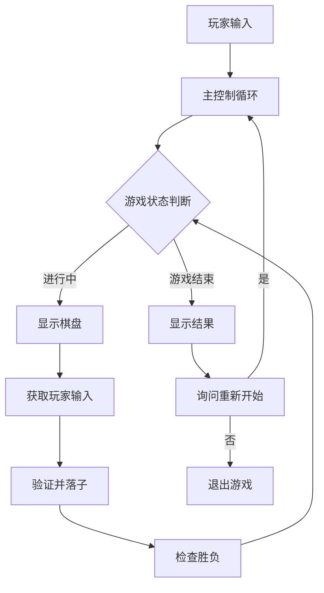
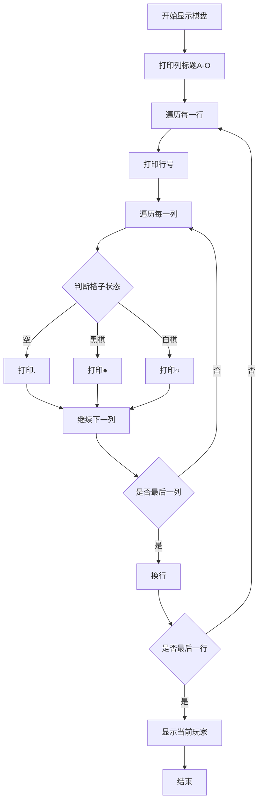
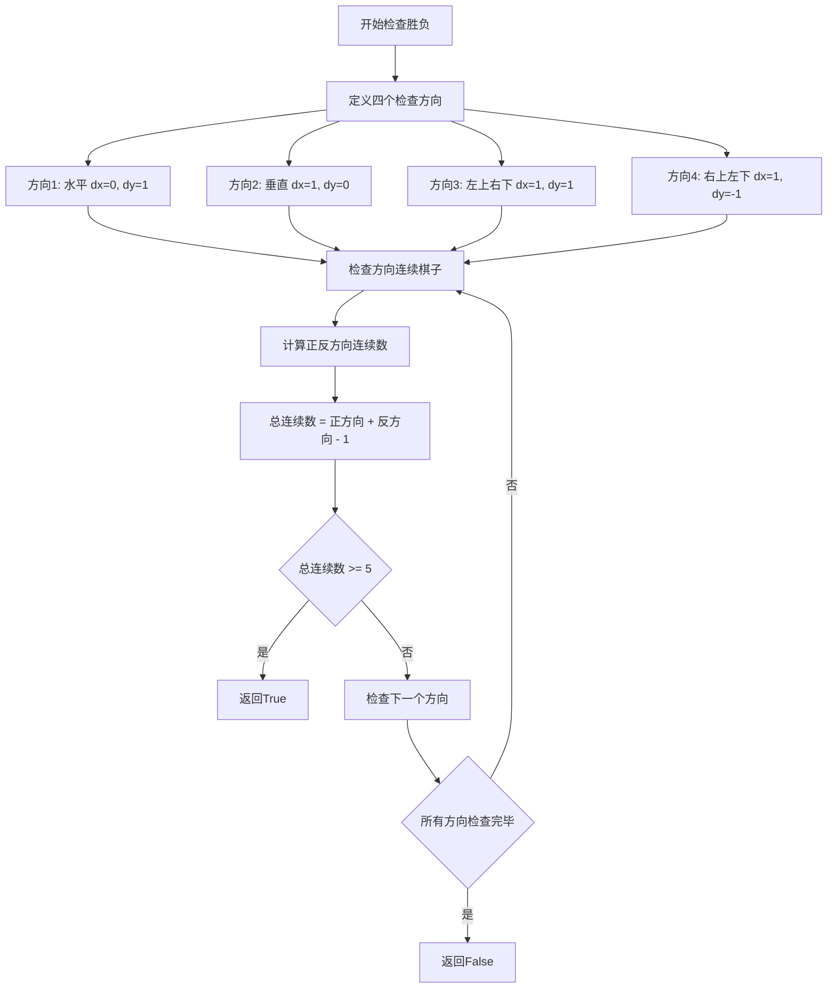
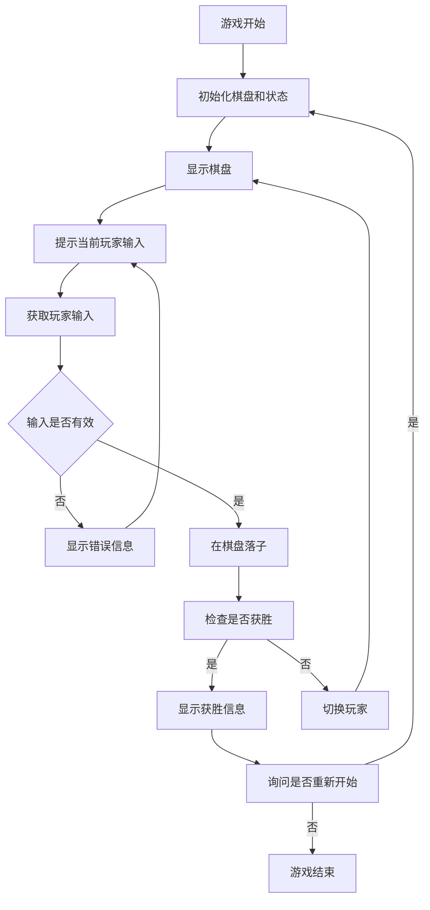

# 软件设计文档

## 1. 系统架构

### 1.1 整体架构

**架构说明**：这是一个简单的控制台五子棋游戏，采用单文件架构，所有功能模块都在一个Python文件中实现。游戏采用面向过程的设计，通过函数模块化组织代码。

**技术栈**：
- 编程语言：Python 3.6+
- 界面：控制台字符界面
- 依赖：无外部依赖，仅使用Python标准库

**架构图**：


### 1.2 模块划分

| 模块名称 | 职责 | 依赖模块 |
|---------|------|----------|
| 棋盘管理 | 初始化、显示、更新棋盘状态 | 无 |
| 输入处理 | 解析玩家输入的坐标，验证有效性 | 棋盘管理 |
| 游戏逻辑 | 落子、胜负判断、游戏状态管理 | 棋盘管理 |
| 主程序 | 控制游戏流程，协调各模块 | 所有模块 |

### 1.3 项目目录结构

```
gomoku/
└── gomoku.py    # 主程序文件，包含所有功能
```

## 2. API 设计

### 2.1 数据表示

**棋盘状态**：
- 使用15x15的二维列表表示棋盘
- 每个位置的值：0（空）、1（黑棋）、2（白棋）

**坐标系统**：
- 内部：使用(0-14, 0-14)的整数坐标
- 外部：使用"A1"到"O15"的字母+数字格式

### 2.2 核心函数接口

#### 2.2.1 棋盘管理模块

**函数名称**：`init_board()`

功能：初始化空棋盘

返回值：
```python
[[0 for _ in range(15)] for _ in range(15)]
```

**函数名称**：`print_board(board)`

功能：在控制台显示棋盘

参数：
| 参数名 | 类型 | 必填 | 说明 |
|--------|------|------|------|
| board | list | 是 | 15x15的棋盘状态 |

**函数名称**：`place_stone(board, row, col, player)`

功能：在指定位置放置棋子

参数：
| 参数名 | 类型 | 必填 | 说明 |
|--------|------|------|------|
| board | list | 是 | 棋盘状态 |
| row | int | 是 | 行坐标(0-14) |
| col | int | 是 | 列坐标(0-14) |
| player | int | 是 | 玩家(1:黑棋, 2:白棋) |

返回值：更新后的棋盘

#### 2.2.2 输入处理模块

**函数名称**：`parse_input(input_str)`

功能：解析玩家输入的坐标

参数：
| 参数名 | 类型 | 必填 | 说明 |
|--------|------|------|------|
| input_str | str | 是 | 玩家输入的坐标字符串 |

返回值：(row, col) 或 None（如果输入无效）

**函数名称**：`is_valid_move(board, row, col)`

功能：验证落子位置是否有效

参数：
| 参数名 | 类型 | 必填 | 说明 |
|--------|------|------|------|
| board | list | 是 | 棋盘状态 |
| row | int | 是 | 行坐标 |
| col | int | 是 | 列坐标 |

返回值：bool（True表示有效）

#### 2.2.3 游戏逻辑模块

**函数名称**：`check_win(board, row, col, player)`

功能：检查指定位置落子后是否获胜

参数：
| 参数名 | 类型 | 必填 | 说明 |
|--------|------|------|------|
| board | list | 是 | 棋盘状态 |
| row | int | 是 | 行坐标 |
| col | int | 是 | 列坐标 |
| player | int | 是 | 玩家(1:黑棋, 2:白棋) |

返回值：bool（True表示获胜）

**函数名称**：`check_direction(board, row, col, dx, dy, player)`

功能：检查指定方向上的连续棋子数

参数：
| 参数名 | 类型 | 必填 | 说明 |
|--------|------|------|------|
| board | list | 是 | 棋盘状态 |
| row | int | 是 | 起始行坐标 |
| col | int | 是 | 起始列坐标 |
| dx | int | 是 | 行方向增量(-1,0,1) |
| dy | int | 是 | 列方向增量(-1,0,1) |
| player | int | 是 | 玩家(1:黑棋, 2:白棋) |

返回值：int（连续棋子数）

## 3. 数据库设计

本项目不需要数据库，所有状态保存在内存中。

## 4. 核心模块设计

### 4.1 棋盘管理模块

**职责**：管理棋盘状态的初始化、显示和更新

**核心函数**：
- `init_board()`: 创建空棋盘
- `print_board(board)`: 显示棋盘
- `place_stone(board, row, col, player)`: 放置棋子

**流程图**：


### 4.2 游戏逻辑模块

**职责**：实现游戏规则，包括胜负判断

**核心算法**：胜负判断算法



### 4.3 主程序模块

**职责**：控制游戏主循环和流程

**主循环流程图**：


## 5. 错误处理设计

### 5.1 输入验证错误
- 坐标格式错误（如"AA1"、"1A"等）
- 坐标超出范围（如"P1"、"A16"等）
- 位置已有棋子

### 5.2 处理策略
- 提供清晰的错误提示信息
- 允许玩家重新输入
- 不中断游戏流程

## 6. 界面设计

### 6.1 棋盘显示格式
```
    A B C D E F G H I J K L M N O
  1 . . . . . . . . . . . . . . .
  2 . . . . . . . . . . . . . . .
  ...（中间省略）...
 14 . . . . . . . . . . . . . . .
 15 . . . . . . . . . . . . . . .

当前玩家：黑棋 (●)
请输入落子位置（如A1）：
```

### 6.2 棋子表示
- 空位：`.` 
- 黑棋：`●`（或`X`）
- 白棋：`○`（或`O`）

## 7. 测试策略

### 7.1 功能测试点
1. 棋盘初始化是否正确
2. 坐标解析功能
3. 落子验证逻辑
4. 胜负判断算法
5. 游戏流程控制

### 7.2 边界测试
- 棋盘边界位置落子
- 连续五子的各种情况
- 无效输入的各种情况