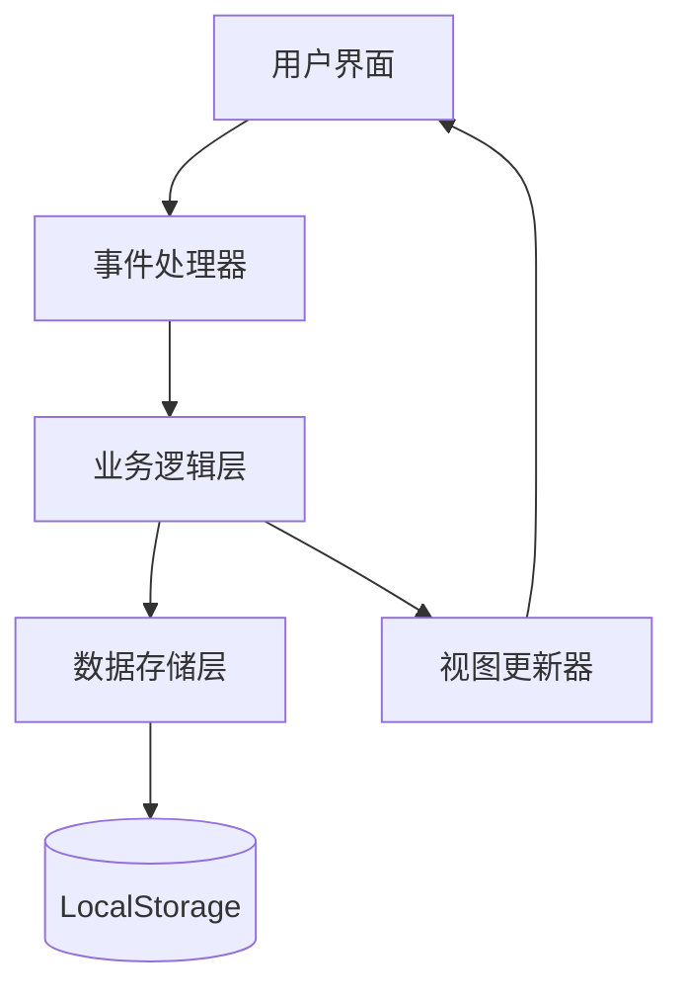
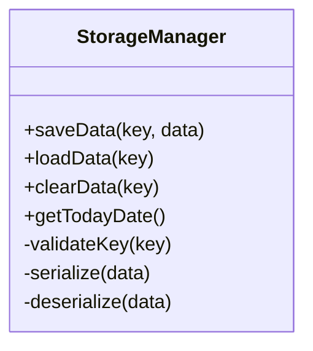
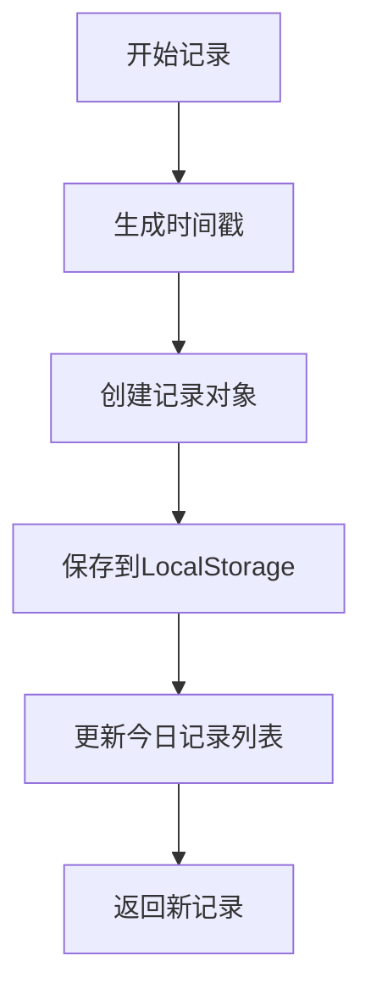
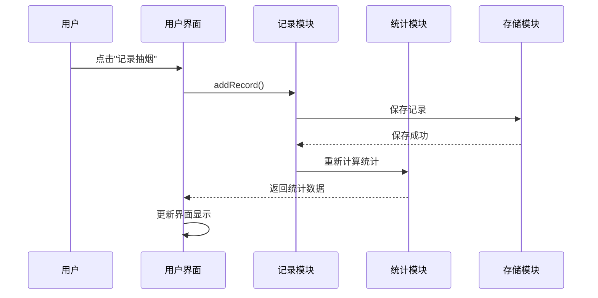

# 软件设计文档

## 1. 系统架构

### 1.1 整体架构

**架构说明**：这是一个纯前端Web应用，采用HTML/CSS/JavaScript技术栈，数据存储在浏览器LocalStorage中。应用采用模块化设计，分离数据层、业务逻辑层和展示层。

**技术栈**：
- 前端：HTML5, CSS3, JavaScript (ES6+)
- 存储：浏览器LocalStorage API
- UI框架：原生CSS，无外部依赖
- 图标：Font Awesome（CDN引入）

**架构图**：


### 1.2 模块划分

| 模块名称 | 职责 | 依赖模块 |
|------|------|------|
| 数据存储模块 | 管理LocalStorage的读写操作 | 无 |
| 抽烟记录模块 | 处理抽烟记录的增删改查 | 数据存储模块 |
| 统计计算模块 | 计算统计数据（次数、间隔、金额） | 抽烟记录模块 |
| 用户界面模块 | 管理DOM操作和事件监听 | 抽烟记录模块、统计计算模块 |
| 设置管理模块 | 管理用户设置（烟价等） | 数据存储模块 |

### 1.3 项目目录结构

```
smoking-assistant/
├── index.html          # 主页面
├── style.css           # 样式文件
├── app.js              # 主应用逻辑
├── modules/
│   ├── storage.js      # 数据存储模块
│   ├── records.js      # 抽烟记录模块
│   ├── stats.js        # 统计计算模块
│   └── ui.js           # 用户界面模块
└── README.md           # 项目说明
```

## 2. 数据设计

### 2.1 数据模型

#### 抽烟记录 (SmokingRecord)
```javascript
{
  id: "uuid-string",      // 唯一标识
  timestamp: 1234567890,  // 时间戳（毫秒）
  date: "2024-01-15"      // 日期字符串，用于快速过滤
}
```

#### 用户设置 (UserSettings)
```javascript
{
  cigarettePrice: 5,      // 每支烟价格（元）
  dailyGoal: 10,          // 每日目标（最多抽几支）
  currency: "¥"           // 货币符号
}
```

#### 应用状态 (AppState)
```javascript
{
  todayRecords: [],       // 今日记录数组
  settings: {},           // 用户设置
  stats: {}               // 统计信息
}
```

### 2.2 LocalStorage键设计

| 键名 | 数据类型 | 说明 |
|------|----------|------|
| `smoking_records` | Array | 所有抽烟记录 |
| `user_settings` | Object | 用户设置 |
| `app_last_updated` | String | 最后更新时间 |

## 3. 核心模块设计

### 3.1 数据存储模块 (storage.js)

**职责**：封装LocalStorage操作，提供统一的数据存取接口。

**接口**：
```javascript
// 保存数据
saveData(key, data) -> boolean

// 读取数据
loadData(key) -> any

// 清空数据
clearData(key) -> boolean

// 获取今日日期
getTodayDate() -> string
```

**类图**：


### 3.2 抽烟记录模块 (records.js)

**职责**：管理抽烟记录的增删改查操作。

**接口**：
```javascript
// 添加新记录
addRecord() -> SmokingRecord

// 获取今日记录
getTodayRecords() -> Array

// 删除今日记录
clearTodayRecords() -> boolean

// 获取最近一次记录
getLastRecord() -> SmokingRecord|null
```

**流程图**：


### 3.3 统计计算模块 (stats.js)

**职责**：计算各种统计数据。

**接口**：
```javascript
// 计算今日抽烟次数
calculateTodayCount(records) -> number

// 计算节省金额
calculateSavedMoney(count, price) -> number

// 计算平均间隔
calculateAverageInterval(records) -> string

// 计算所有统计
calculateAllStats(records, settings) -> StatsObject
```

**StatsObject结构**：
```javascript
{
  todayCount: 5,
  savedMoney: 25,
  lastTime: "14:30",
  avgInterval: "2小时30分",
  dailyGoalProgress: 50 // 百分比
}
```

### 3.4 用户界面模块 (ui.js)

**职责**：管理DOM操作和事件处理。

**接口**：
```javascript
// 初始化UI
initUI() -> void

// 更新统计数据展示
updateStatsDisplay(stats) -> void

// 绑定事件
bindEvents() -> void

// 显示确认对话框
showConfirm(message, callback) -> void
```

**时序图**：


## 4. 用户界面设计

### 4.1 页面布局

```html
<div class="app-container">
  <!-- 头部 -->
  <header class="app-header">
    <h1>抽烟小助手</h1>
  </header>
  
  <!-- 统计卡片区域 -->
  <div class="stats-container">
    <div class="stat-card">
      <h3>今日抽烟次数</h3>
      <div class="stat-value" id="today-count">0</div>
    </div>
    <div class="stat-card">
      <h3>节省金额</h3>
      <div class="stat-value" id="saved-money">¥0</div>
    </div>
    <div class="stat-card">
      <h3>最近一次</h3>
      <div class="stat-value" id="last-time">--:--</div>
    </div>
    <div class="stat-card">
      <h3>平均间隔</h3>
      <div class="stat-value" id="avg-interval">--</div>
    </div>
  </div>
  
  <!-- 操作按钮 -->
  <div class="actions-container">
    <button id="record-btn" class="btn-primary">记录抽烟</button>
    <button id="reset-btn" class="btn-secondary">重置今日数据</button>
  </div>
  
  <!-- 设置区域 -->
  <div class="settings-container">
    <h3>设置</h3>
    <div class="setting-item">
      <label>每支烟价格（元）</label>
      <input type="number" id="cigarette-price" min="0" step="0.1" value="5">
    </div>
  </div>
  
  <!-- 历史记录 -->
  <div class="history-container">
    <h3>今日记录</h3>
    <div id="history-list"></div>
  </div>
</div>
```

### 4.2 响应式设计

**断点设计**：
- 手机：< 768px
- 平板：768px - 1024px  
- 桌面：> 1024px

**布局变化**：
- 手机：单列布局，统计卡片垂直排列
- 平板：两列布局
- 桌面：四列布局

## 5. 错误处理设计

### 5.1 错误类型

| 错误类型 | 原因 | 处理方式 |
|----------|------|----------|
| LocalStorage不可用 | 浏览器禁用/隐私模式 | 降级到内存存储，显示警告 |
| 数据格式错误 | 手动修改LocalStorage | 尝试修复，无法修复则重置 |
| 存储空间不足 | 记录过多 | 自动清理旧记录，保留最近30天 |

### 5.2 用户反馈

- 成功操作：显示短暂的成功提示
- 错误操作：显示错误信息，指导用户操作
- 确认操作：重要操作（如重置）需要二次确认

## 6. 性能优化

### 6.1 数据存储优化
- 定期清理过期记录（超过30天）
- 使用JSON压缩存储
- 批量操作减少LocalStorage访问

### 6.2 界面渲染优化
- 使用CSS动画而非JavaScript动画
- 避免频繁的DOM操作
- 使用事件委托减少事件监听器

### 6.3 内存管理
- 及时清理不再使用的数据引用
- 使用弱引用存储临时数据
- 避免内存泄漏