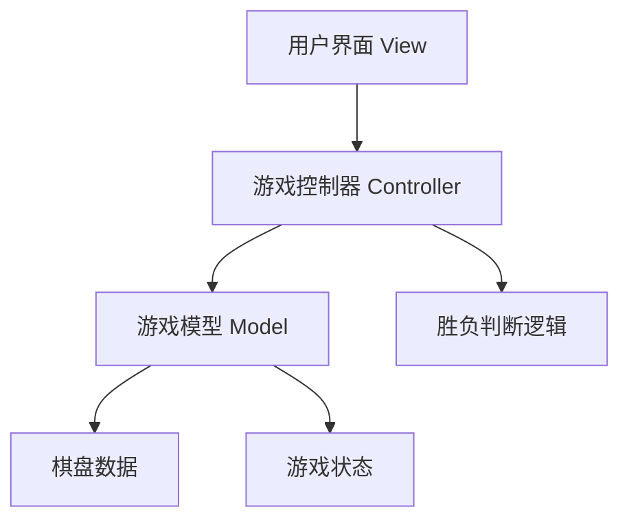
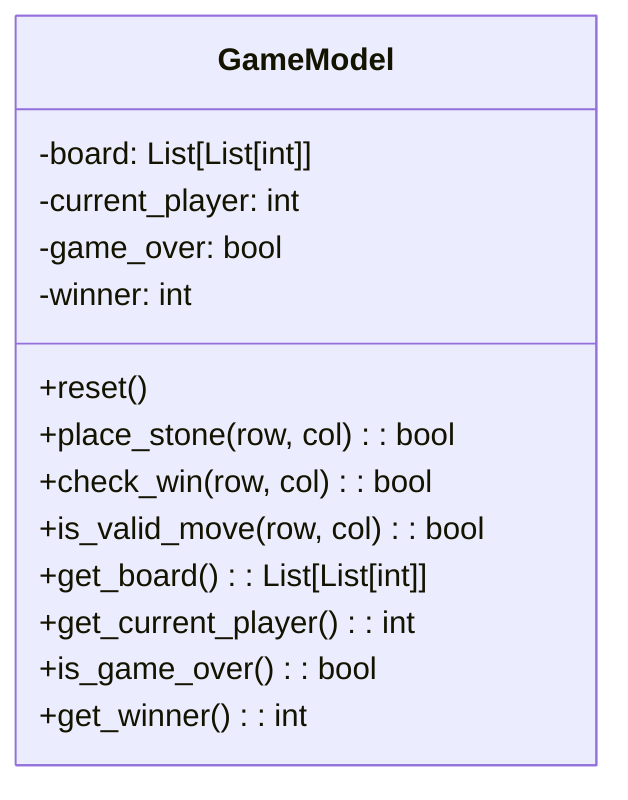
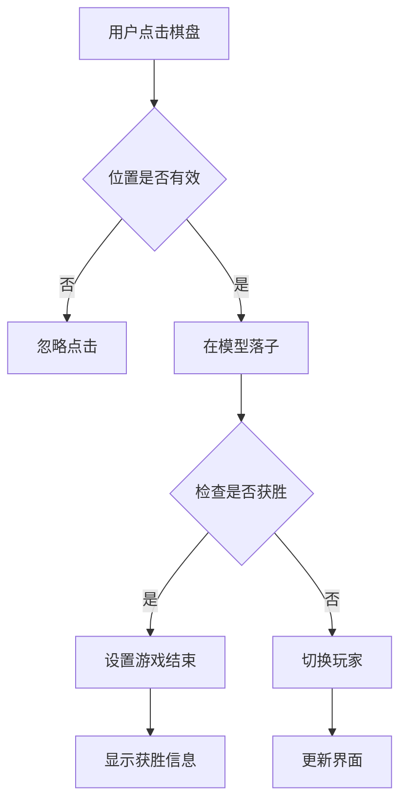
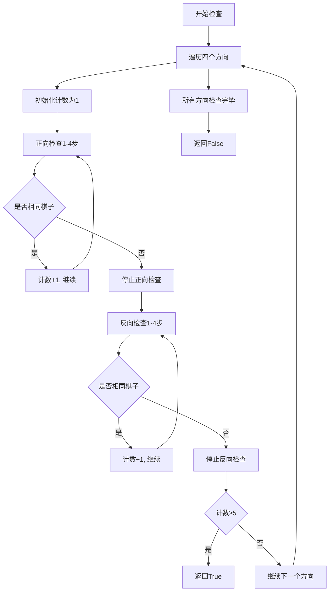

# 软件设计文档

## 1. 系统架构

### 1.1 整体架构

**架构说明**：这是一个简单的单机五子棋游戏，采用MVC（Model-View-Controller）设计模式。游戏逻辑与界面分离，便于维护和扩展。

**技术栈**：
- GUI框架：Tkinter（Python标准库）
- 编程语言：Python 3.6+
- 数据存储：内存数据结构
- 部署方式：单文件Python脚本

**架构图**：


### 1.2 模块划分

| 模块名称 | 职责 | 依赖模块 |
|----------|------|----------|
| GameModel | 管理游戏数据状态 | 无 |
| GameController | 处理游戏逻辑和用户输入 | GameModel |
| GameView | 显示游戏界面和接收用户输入 | GameController |

### 1.3 项目目录结构

```
gomoku_game/
├── gomoku.py          # 主程序文件，包含所有代码
└── README.md          # 项目说明文档
```

## 2. 核心模块设计

### 2.1 GameModel（游戏模型）

**职责**：管理游戏的核心数据状态

**数据结构**：
- `board`: 15x15二维列表，存储棋盘状态
  - 0: 空位置
  - 1: 黑棋
  - 2: 白棋
- `current_player`: 当前玩家（1=黑棋，2=白棋）
- `game_over`: 游戏是否结束
- `winner`: 获胜方（0=未结束，1=黑棋胜，2=白棋胜）

**接口**：
- `reset()`: 重置游戏状态
- `place_stone(row, col) -> bool`: 在指定位置落子
- `check_win(row, col) -> bool`: 检查是否获胜
- `is_valid_move(row, col) -> bool`: 检查落子是否有效

**类图**：


### 2.2 GameController（游戏控制器）

**职责**：处理游戏逻辑和用户输入

**接口**：
- `handle_click(row, col)`: 处理棋盘点击事件
- `restart_game()`: 重新开始游戏
- `get_game_status() -> dict`: 获取游戏状态

**流程图**：


### 2.3 GameView（游戏视图）

**职责**：显示游戏界面和接收用户输入

**组件**：
- 主窗口：600x600像素
- 画布：绘制棋盘和棋子
- 状态标签：显示当前玩家和游戏状态
- 重新开始按钮：重置游戏

**界面布局**：
```
+-----------------------------------+
|           状态栏                  |
+-----------------------------------+
|                                   |
|           棋盘区域                |
|          (15x15网格)              |
|                                   |
+-----------------------------------+
|         [重新开始] 按钮           |
+-----------------------------------+
```

## 3. 关键算法设计

### 3.1 胜负判断算法

**算法描述**：检查四个方向（水平、垂直、左斜、右斜）是否有连续五个相同棋子

**伪代码**：
```
function check_win(row, col, player):
    directions = [
        (0, 1),   # 水平
        (1, 0),   # 垂直
        (1, 1),   # 右斜
        (1, -1)   # 左斜
    ]
    
    for dx, dy in directions:
        count = 1  # 当前位置
        
        # 正向检查
        for i in range(1, 5):
            new_row = row + dx * i
            new_col = col + dy * i
            if 位置有效且棋子相同:
                count += 1
            else:
                break
        
        # 反向检查
        for i in range(1, 5):
            new_row = row - dx * i
            new_col = col - dy * i
            if 位置有效且棋子相同:
                count += 1
            else:
                break
        
        if count >= 5:
            return True
    
    return False
```

**流程图**：


## 4. 详细设计

### 4.1 坐标转换

**问题**：屏幕坐标转换为棋盘坐标

**解决方案**：
```
棋盘大小：15x15
网格间距：40像素
边距：20像素

屏幕坐标(x,y)转棋盘坐标(row,col):
row = (y - margin) // grid_size
col = (x - margin) // grid_size

棋盘坐标(row,col)转屏幕坐标(x,y):
x = margin + col * grid_size
y = margin + row * grid_size
```

### 4.2 事件处理

**鼠标点击事件处理**：
1. 获取鼠标点击坐标
2. 转换为棋盘坐标
3. 验证坐标有效性（0-14范围内）
4. 调用控制器处理落子
5. 更新界面显示

### 4.3 界面绘制

**棋盘绘制**：
1. 绘制15条水平线
2. 绘制15条垂直线
3. 线宽：1像素，颜色：黑色

**棋子绘制**：
1. 黑棋：黑色实心圆，半径：18像素
2. 白棋：白色实心圆，黑色边框，半径：18像素

## 5. 错误处理设计

### 5.1 输入验证
- 棋盘坐标范围检查（0-14）
- 落子位置是否已有棋子检查
- 游戏是否已结束检查

### 5.2 异常处理
- 使用try-except处理可能的异常
- 提供友好的错误提示
- 确保程序不会崩溃

## 6. 性能考虑

### 6.1 时间复杂度
- 胜负检查：O(1) 每次落子只检查周围位置
- 落子操作：O(1) 直接更新数组元素
- 界面更新：O(n²) 但n=15，可接受

### 6.2 内存使用
- 棋盘数组：15x15 = 225个整数
- 界面组件：Tkinter对象
- 总体内存消耗：< 10MB

## 7. 扩展性考虑

### 7.1 未来可能的功能扩展
1. AI对手：添加简单的AI算法
2. 游戏记录：保存和加载游戏
3. 难度选择：不同级别的AI
4. 网络对战：添加网络功能
5. 声音效果：落子和获胜音效

### 7.2 代码结构优化
- 将模型、视图、控制器分离到不同文件
- 添加配置文件
- 支持主题切换