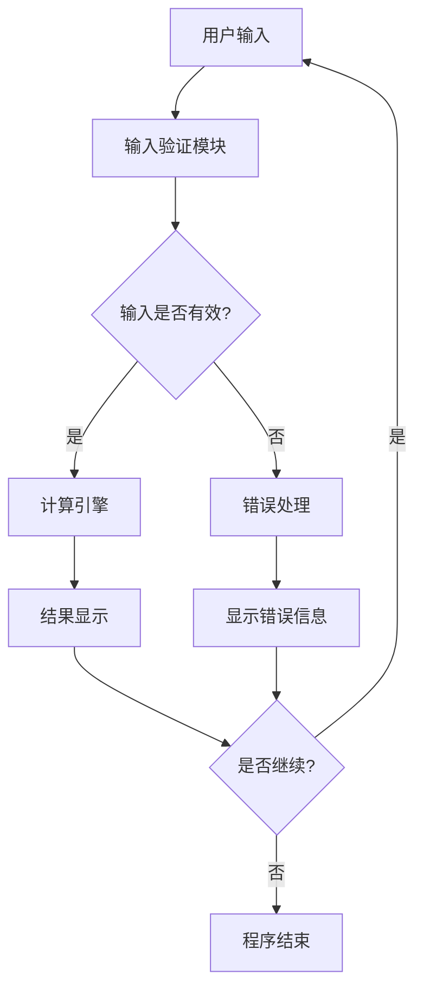
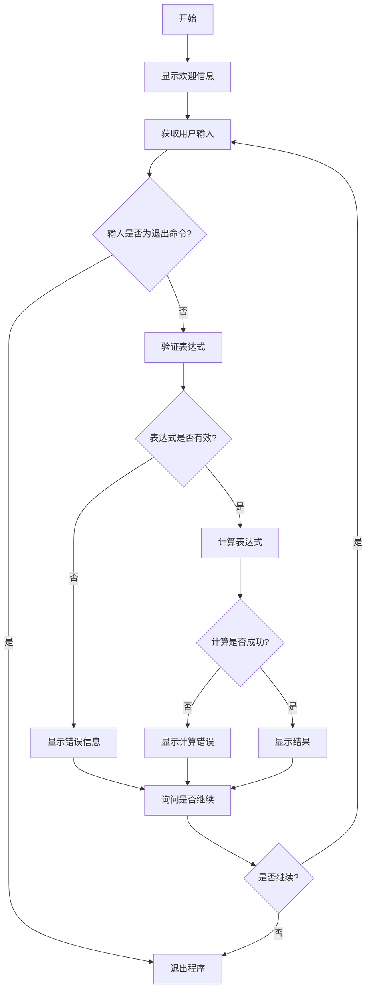
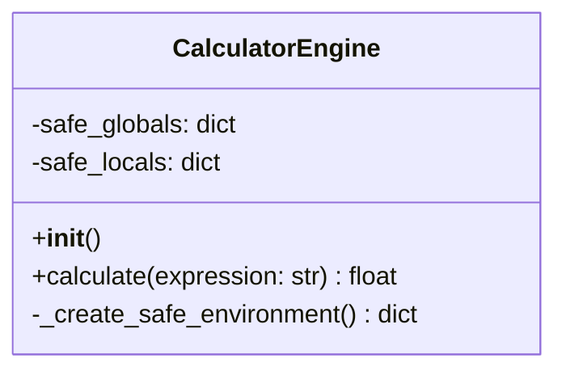
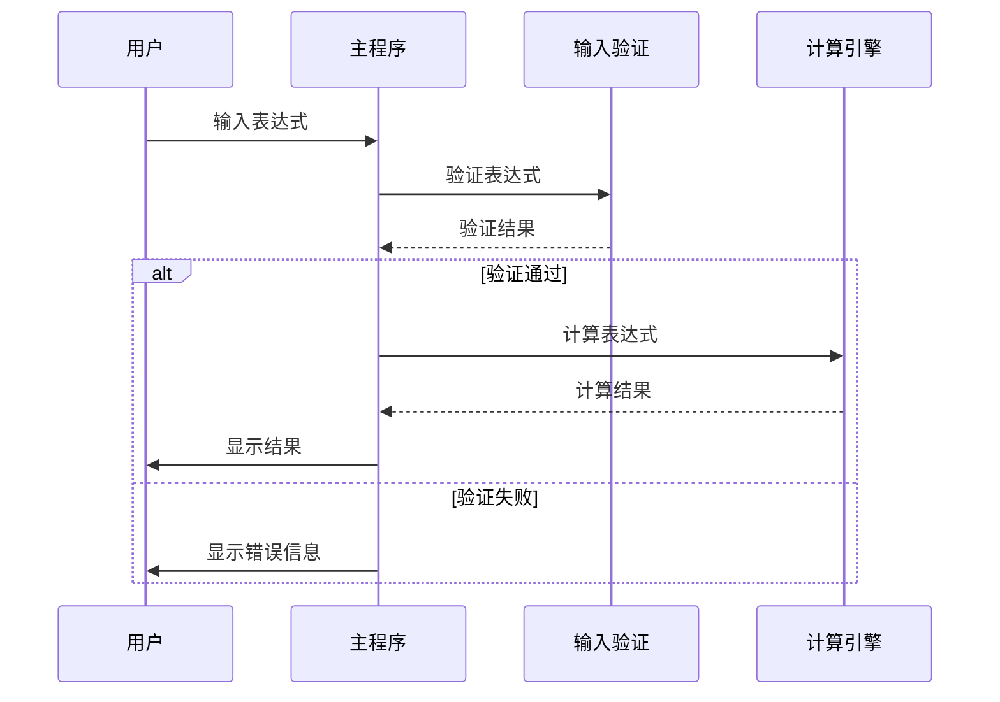

# 软件设计文档

## 1. 系统架构

### 1.1 整体架构

**架构说明**：这是一个简单的单文件Python脚本，采用模块化设计，包含输入处理、计算引擎和用户交互三个主要部分。

**技术栈**：
- 语言：Python 3.6+
- 标准库：math（可选，用于扩展功能）
- 第三方库：无

**架构图**：


### 1.2 模块划分

| 模块名称 | 职责 | 依赖模块 |
|----------|------|----------|
| 主程序模块 | 程序入口，控制流程 | 所有其他模块 |
| 输入处理模块 | 获取和验证用户输入 | 无 |
| 计算引擎模块 | 执行数学计算 | 无 |
| 用户界面模块 | 显示信息和结果 | 无 |
| 错误处理模块 | 处理各种异常情况 | 无 |

### 1.3 项目目录结构

```
simple_calculator/
├── calculator.py      # 主程序文件
├── requirements.txt   # 依赖文件（仅Python标准库）
└── README.md         # 使用说明
```

## 2. API 设计

### 2.1 接口规范

由于这是一个命令行程序，没有HTTP API。以下是程序内部函数接口：

**通用规范**：
- 所有函数都有类型提示
- 函数名使用小写字母和下划线
- 错误通过异常或返回值处理

### 2.2 核心函数接口

#### 2.2.1 输入处理模块

**函数名称**：`get_user_input() -> str`

功能：获取用户输入的数学表达式

返回值：
- 成功：用户输入的字符串
- 用户退出：返回空字符串或特定退出标志

**函数名称**：`validate_expression(expression: str) -> bool`

功能：验证表达式是否安全有效

参数：
| 参数名 | 类型 | 必填 | 说明 |
|--------|------|------|------|
| expression | str | 是 | 用户输入的表达式 |

返回值：
- True：表达式安全有效
- False：表达式不安全或无效

#### 2.2.2 计算引擎模块

**函数名称**：`calculate(expression: str) -> float`

功能：计算数学表达式的结果

参数：
| 参数名 | 类型 | 必填 | 说明 |
|--------|------|------|------|
| expression | str | 是 | 有效的数学表达式 |

返回值：
- 成功：计算结果（浮点数）
- 失败：抛出异常

可能抛出的异常：
- ValueError：表达式语法错误
- ZeroDivisionError：除零错误
- TypeError：类型错误

#### 2.2.3 用户界面模块

**函数名称**：`display_welcome() -> None`

功能：显示欢迎信息

**函数名称**：`display_result(result: float) -> None`

功能：显示计算结果

参数：
| 参数名 | 类型 | 必填 | 说明 |
|--------|------|------|------|
| result | float | 是 | 计算结果 |

**函数名称**：`display_error(error_msg: str) -> None`

功能：显示错误信息

参数：
| 参数名 | 类型 | 必填 | 说明 |
|--------|------|------|------|
| error_msg | str | 是 | 错误描述 |

**函数名称**：`ask_to_continue() -> bool`

功能：询问用户是否继续计算

返回值：
- True：用户选择继续
- False：用户选择退出

## 3. 数据库设计

本项目不需要数据库，所有数据在内存中处理。

## 4. 核心模块设计

### 4.1 主程序模块

**职责**：控制程序流程，协调各个模块

**流程图**：


### 4.2 计算引擎模块

**职责**：安全地计算数学表达式

**设计要点**：
1. 使用Python的`eval()`函数，但限制可用的函数和变量
2. 创建安全的环境，只允许数学运算
3. 处理各种数学异常

**类图**：


**安全环境设计**：
- 允许的运算符：`+`, `-`, `*`, `/`, `//`, `%`, `**`
- 允许的函数：`abs`, `round`, `pow`, `min`, `max`
- 允许的常量：`pi`, `e`
- 禁止：所有内置函数、模块导入、属性访问

### 4.3 错误处理模块

**职责**：处理各种异常情况

**异常类型映射**：
| 异常类型 | 用户友好信息 | 处理方式 |
|----------|--------------|----------|
| SyntaxError | "表达式语法错误，请检查输入" | 提示重新输入 |
| ZeroDivisionError | "不能除以零" | 提示重新输入 |
| TypeError | "类型错误，请检查输入" | 提示重新输入 |
| ValueError | "数值错误，请检查输入" | 提示重新输入 |
| 其他异常 | "计算过程中发生错误" | 提示重新输入 |

### 4.4 输入验证模块

**职责**：验证用户输入的安全性

**验证规则**：
1. 长度限制：不超过1000字符
2. 字符限制：只允许数字、运算符、空格、括号和少数数学函数
3. 关键字过滤：过滤危险的关键字（如`import`, `exec`, `eval`等）
4. 括号匹配：检查括号是否匹配

**时序图**：


## 5. 安全设计

### 5.1 输入安全
- 使用白名单验证输入字符
- 限制表达式长度
- 过滤危险关键字
- 使用安全的eval环境

### 5.2 计算安全
- 创建受限的命名空间
- 只允许数学相关函数
- 禁止所有内置函数和模块导入

## 6. 扩展性设计

### 6.1 可扩展的运算符
设计支持未来添加新运算符的架构

### 6.2 可配置的精度
支持设置小数精度

### 6.3 历史记录功能
预留添加历史记录功能的接口

## 7. 测试设计

### 7.1 单元测试
- 测试基本运算：`2+2`, `3*4`, `10/2`
- 测试运算符优先级：`2+3*4`
- 测试错误处理：`10/0`, `invalid expression`

### 7.2 集成测试
- 测试完整流程
- 测试连续计算
- 测试退出功能